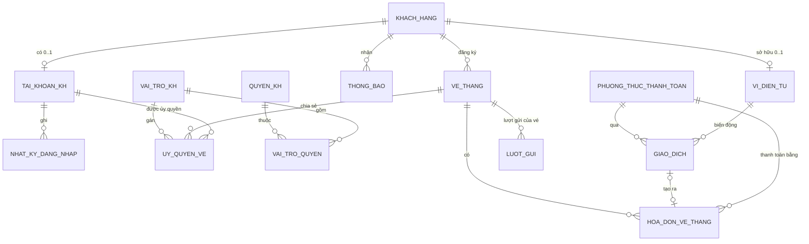

# KẾ HOẠCH NÂNG CẤP CSDL: CỔNG KHÁCH HÀNG VÉ THÁNG (CUSTOMER PORTAL V7)

> **Phạm vi:** Bổ sung tài khoản đăng nhập cho khách hàng vé tháng, ví điện tử để tự nạp tiền và gia hạn, lịch sử đỗ xe, lịch sử giao dịch (số tiền, phương thức thanh toán, trạng thái…), cùng cơ chế phân quyền riêng cho tài khoản khách hàng.
> **Nền tảng:** Microsoft SQL Server 2022 (T-SQL), Flask. Nâng cấp **tăng dần** trên CSDL `QuanLyBaiDoXe` hiện có (11 bảng, 6 procedures, 7 triggers, 3 functions, 2 cursors, 22 views).
> **Nguyên tắc:** không phá vỡ các chức năng và 9 kịch bản demo hiện tại. Mọi thay đổi trên bảng cũ chỉ **thêm cột cho phép NULL hoặc có DEFAULT**, không đổi tên và không xóa cột.

---

## Mục lục

1. [Hiện trạng và vấn đề cần giải quyết](#1-hiện-trạng-và-vấn-đề-cần-giải-quyết)
2. [Quyết định thiết kế chính](#2-quyết-định-thiết-kế-chính)
3. [Thiết kế Schema mới](#3-thiết-kế-schema-mới)
4. [Cơ chế phân quyền tài khoản khách hàng](#4-cơ-chế-phân-quyền-tài-khoản-khách-hàng)
5. [Stored Procedures](#5-stored-procedures)
6. [Functions](#6-functions)
7. [Triggers](#7-triggers)
8. [Cursors](#8-cursors)
9. [Views](#9-views)
10. [Kịch bản Demo mới (chuẩn 5 bước)](#10-kịch-bản-demo-mới-chuẩn-5-bước)
11. [Dữ liệu mẫu bổ sung](#11-dữ-liệu-mẫu-bổ-sung)
12. [Cập nhật ứng dụng Web](#12-cập-nhật-ứng-dụng-web)
13. [Lộ trình triển khai và tổ chức file SQL](#13-lộ-trình-triển-khai-và-tổ-chức-file-sql)
14. [Kiểm thử và tiêu chí nghiệm thu](#14-kiểm-thử-và-tiêu-chí-nghiệm-thu)
15. [Rủi ro và nợ kỹ thuật xử lý kèm](#15-rủi-ro-và-nợ-kỹ-thuật-xử-lý-kèm)

---

## 1. Hiện trạng và vấn đề cần giải quyết

| Nhu cầu | Hiện trạng trong CSDL | Hạn chế |
|---|---|---|
| Khách hàng đăng nhập | `TAI_KHOAN.MaNV` là `NOT NULL` và có FK tới `NHAN_VIEN`, nên bảng này chỉ dành cho nhân viên | Khách hàng không thể có tài khoản |
| Tự nạp tiền | Không có khái niệm số dư hoặc ví | Mọi khoản thu đều phải làm tại quầy |
| Tự gia hạn vé tháng | `sp_GiaHanTheThang` chỉ dành cho nhân viên (`r_QuanLyBai`), không có transaction, mặc định cứng `@MaBaiGiaHan = 'BAI_Q1'` | Không an toàn khi khách tự thao tác; tính sai giá nếu vé thuộc bãi khác |
| Lịch sử giao dịch | `HOA_DON_VE_THANG` chỉ có `SoTien`, `NgayThanhToan` | Không có phương thức thanh toán, trạng thái, mã tham chiếu cổng thanh toán, số dư trước/sau |
| Lịch sử đỗ xe | `LUOT_GUI` chỉ có `MaThe`. Muốn biết khách nào phải JOIN qua `VE_THANG.MaThe` | Sai lịch sử khi thẻ được cấp lại cho vé khác; `UQ_VeThang_MaThe` còn khiến thẻ không thể tái sử dụng |
| Phân quyền khách hàng | RBAC chỉ có 3 vai trò nhân viên: `r_Admin`, `r_QuanLyBai`, `r_BaoVe` | Không có cơ chế bảo đảm khách A không xem được dữ liệu của khách B |

---

## 2. Quyết định thiết kế chính

Các quyết định dưới đây đã được chốt để lập kế hoạch. Mỗi mục ghi kèm lý do và có thể điều chỉnh trước khi bắt đầu Giai đoạn 1.

| # | Quyết định | Lý do |
|---|---|---|
| D1 | Tạo **bảng riêng `TAI_KHOAN_KH`** cho khách hàng, không gộp vào `TAI_KHOAN` | Tách biệt miền bảo mật nhân viên và khách hàng. Không phải sửa `sp_DangNhap` và các FK hiện có; tránh để khách hàng bị nhầm cấp quyền nhân viên |
| D2 | Mô hình **ví trả trước (`VI_DIEN_TU`)**: khách nạp tiền vào ví, sau đó dùng số dư để gia hạn | Tách 2 nghiệp vụ "thu tiền từ cổng thanh toán" và "trừ tiền dịch vụ", giúp đối soát dễ hơn và minh họa rõ transaction và trigger |
| D3 | **Sổ cái giao dịch bất biến (`GIAO_DICH`)**: mọi biến động số dư đều là một dòng giao dịch; không sửa, không xóa | Chuẩn kế toán (append-only ledger), phục vụ truy vết và đối soát |
| D4 | **Số dư ví chỉ được cập nhật bởi trigger** khi giao dịch chuyển sang `Thành công` | Một nguồn sự thật duy nhất. Không procedure nào được `UPDATE VI_DIEN_TU.SoDu` trực tiếp (dùng `DENY` để chặn) |
| D5 | Nạp tiền theo **2 pha**: khởi tạo (`Chờ xử lý`) rồi xác nhận từ cổng thanh toán, có **idempotency** theo `MaThamChieu` | Mô phỏng đúng luồng MoMo/VNPay; bảo đảm callback gọi lặp không cộng tiền 2 lần |
| D6 | Phân quyền khách hàng gồm **3 lớp**: DB role `r_KhachHang` + Row-Level Security + quyền nghiệp vụ theo vai trò và ủy quyền | Lớp DB chặn truy cập bảng gốc; RLS cô lập dữ liệu từng khách; lớp nghiệp vụ cho phép chia sẻ vé (ví dụ người nhà) với quyền hạn chế |
| D7 | Mật khẩu khách hàng dùng **SHA2_512 + salt ngẫu nhiên 16 byte** (`CRYPT_GEN_RANDOM`) | Mạnh hơn SHA2_256 không salt đang dùng cho nhân viên. Tài khoản nhân viên giữ nguyên, việc nâng cấp để ở mục [15](#15-rủi-ro-và-nợ-kỹ-thuật-xử-lý-kèm) |
| D8 | Chỉ khách hàng **đã có hồ sơ `KHACH_HANG`** (đã từng đăng ký vé tại quầy) mới được tự tạo tài khoản, xác minh bằng SĐT và CCCD | Tránh tài khoản rác; đăng ký vé mới vẫn làm tại quầy vì phải cấp thẻ vật lý |
| D9 | Mã giao dịch và mã hóa đơn mới sinh bằng **`SEQUENCE`** thay vì `FORMAT(GETDATE(), ...)` | Mã cũ sinh theo phút/giây nên có thể trùng khi 2 giao dịch xảy ra cùng lúc |
| D10 | Dải mã lỗi mới: **50030 – 50069** | Không đụng mã cũ (lưu ý mã cũ đang trùng `50007`, xem mục 15) |

---

## 3. Thiết kế Schema mới

### 3.1. Sơ đồ quan hệ (ERD phần mở rộng)



### 3.2. Bảng mới (10 bảng, tổng sau nâng cấp: 21 bảng)

#### (12) `PHUONG_THUC_THANH_TOAN`: Danh mục phương thức thanh toán

| Cột | Kiểu | Ràng buộc | Ghi chú |
|---|---|---|---|
| `MaPTTT` | `VARCHAR(20)` | PK | `TIEN_MAT`, `CHUYEN_KHOAN`, `MOMO`, `ZALOPAY`, `VNPAY`, `THE_NH`, `SO_DU_VI` |
| `TenPTTT` | `NVARCHAR(100)` | NOT NULL, UNIQUE | Tên hiển thị |
| `LoaiKenh` | `NVARCHAR(30)` | CHECK IN (`Tiền mặt`, `Ngân hàng`, `Ví điện tử`, `Thẻ`, `Số dư ví`) | |
| `PhiPhanTram` | `DECIMAL(5,2)` | DEFAULT 0, CHECK 0–10 | Phí cổng thanh toán (dùng cho báo cáo doanh thu thuần) |
| `SoTienToiThieu` | `DECIMAL(18,2)` | DEFAULT 10000 | Hạn mức nạp tối thiểu |
| `ChoPhepNapVi` | `BIT` | DEFAULT 1 | `SO_DU_VI` = 0 (không thể dùng ví để nạp vào ví) |
| `TrangThai` | `NVARCHAR(20)` | CHECK IN (`Hoạt động`, `Tạm ngưng`) | Tạm ngưng khi cổng bảo trì |

#### (13) `TAI_KHOAN_KH`: Tài khoản đăng nhập của khách hàng

| Cột | Kiểu | Ràng buộc | Ghi chú |
|---|---|---|---|
| `MaTK` | `VARCHAR(12)` | PK | Sinh từ `SEQUENCE seq_TaiKhoanKH`, dạng `TK000001` |
| `MaKH` | `VARCHAR(10)` | NOT NULL, **UNIQUE**, FK → `KHACH_HANG` | Mỗi khách có tối đa 1 tài khoản |
| `TenDangNhap` | `VARCHAR(100)` | NOT NULL, UNIQUE | SĐT hoặc email |
| `MatKhauHash` | `VARBINARY(64)` | NOT NULL | `HASHBYTES('SHA2_512', Salt + MatKhau)` |
| `MatKhauSalt` | `VARBINARY(16)` | NOT NULL | `CRYPT_GEN_RANDOM(16)` |
| `TrangThai` | `NVARCHAR(20)` | DEFAULT `Hoạt động`, CHECK IN (`Hoạt động`, `Tạm khóa`, `Đã đóng`) | |
| `SoLanSaiLienTiep` | `TINYINT` | DEFAULT 0 | Reset về 0 khi đăng nhập đúng |
| `KhoaDen` | `DATETIME` | NULL | Khóa tạm thời có thời hạn (ví dụ 15 phút) |
| `NgayTao` | `DATETIME` | DEFAULT `GETDATE()` | |
| `LanDangNhapCuoi` | `DATETIME` | NULL | |

#### (14) `NHAT_KY_DANG_NHAP`: Nhật ký đăng nhập (audit bảo mật)

| Cột | Kiểu | Ràng buộc | Ghi chú |
|---|---|---|---|
| `MaNK` | `BIGINT IDENTITY` | PK | |
| `MaTK` | `VARCHAR(12)` | NULL, FK → `TAI_KHOAN_KH` | NULL nếu tên đăng nhập không tồn tại |
| `TenDangNhapNhap` | `VARCHAR(100)` | NOT NULL | Giá trị người dùng đã gõ |
| `ThoiGian` | `DATETIME` | DEFAULT `GETDATE()` | |
| `KetQua` | `NVARCHAR(20)` | CHECK IN (`Thành công`, `Sai mật khẩu`, `Không tồn tại`, `Bị khóa`) | |
| `DiaChiIP` | `VARCHAR(45)` | NULL | Hỗ trợ IPv6 |
| `ThietBi` | `NVARCHAR(200)` | NULL | User-Agent |

Chỉ mục: `IX_NhatKy_MaTK_ThoiGian (MaTK, ThoiGian DESC)`, phục vụ trigger đếm số lần sai.

#### (15) `VI_DIEN_TU`: Ví trả trước của khách hàng

| Cột | Kiểu | Ràng buộc | Ghi chú |
|---|---|---|---|
| `MaVi` | `VARCHAR(12)` | PK | `VI000001` |
| `MaKH` | `VARCHAR(10)` | NOT NULL, **UNIQUE**, FK → `KHACH_HANG` | |
| `SoDu` | `DECIMAL(18,2)` | DEFAULT 0, **CHECK (SoDu >= 0)** | Chặn số dư âm ở mức ràng buộc |
| `HanMucNapNgay` | `DECIMAL(18,2)` | DEFAULT 20000000 | Chống rửa tiền hoặc gian lận |
| `TrangThai` | `NVARCHAR(20)` | CHECK IN (`Hoạt động`, `Đóng băng`) | Đóng băng khi có tranh chấp |
| `NgayTao` | `DATETIME` | DEFAULT `GETDATE()` | |
| `PhienBan` | `ROWVERSION` | | Phát hiện cập nhật đồng thời (optimistic concurrency) |

#### (16) `GIAO_DICH`: Sổ cái giao dịch ví (append-only)

| Cột | Kiểu | Ràng buộc | Ghi chú |
|---|---|---|---|
| `MaGD` | `VARCHAR(16)` | PK | `GD2610000001` (từ `seq_GiaoDich`) |
| `MaVi` | `VARCHAR(12)` | NOT NULL, FK → `VI_DIEN_TU` | |
| `LoaiGD` | `NVARCHAR(30)` | CHECK IN (`Nạp tiền`, `Thanh toán vé tháng`, `Hoàn tiền`, `Điều chỉnh`) | |
| `HuongTien` | `SMALLINT` | CHECK IN (1, -1) | +1 cộng ví, -1 trừ ví |
| `SoTien` | `DECIMAL(18,2)` | CHECK (SoTien > 0) | Luôn dương, chiều tiền nằm ở `HuongTien` |
| `PhiGiaoDich` | `DECIMAL(18,2)` | DEFAULT 0 | Phí cổng thanh toán, do công ty chịu |
| `SoDuTruoc` | `DECIMAL(18,2)` | NULL | Trigger ghi lại khi giao dịch thành công |
| `SoDuSau` | `DECIMAL(18,2)` | NULL | Trigger ghi lại khi giao dịch thành công |
| `MaPTTT` | `VARCHAR(20)` | NOT NULL, FK → `PHUONG_THUC_THANH_TOAN` | Thanh toán bằng ví thì dùng `SO_DU_VI` |
| `MaThamChieu` | `VARCHAR(64)` | NULL | Mã giao dịch phía cổng thanh toán. **Unique index có lọc `WHERE MaThamChieu IS NOT NULL`** (idempotency) |
| `TrangThai` | `NVARCHAR(20)` | CHECK IN (`Chờ xử lý`, `Thành công`, `Thất bại`, `Đã hoàn`) | |
| `MaVe` | `VARCHAR(10)` | NULL, FK → `VE_THANG` | Có giá trị khi `LoaiGD = Thanh toán vé tháng` |
| `MaGDGoc` | `VARCHAR(16)` | NULL, FK → `GIAO_DICH` (tự tham chiếu) | Giao dịch hoàn tiền trỏ về giao dịch gốc |
| `NguoiThucHien` | `NVARCHAR(20)` | CHECK IN (`Khách hàng`, `Nhân viên`, `Hệ thống`) | |
| `MaNV` | `VARCHAR(10)` | NULL, FK → `NHAN_VIEN` | Nhân viên thực hiện hoàn tiền hoặc điều chỉnh |
| `ThoiGianTao` | `DATETIME` | DEFAULT `GETDATE()` | |
| `ThoiGianHoanTat` | `DATETIME` | NULL | |
| `GhiChu` | `NVARCHAR(255)` | NULL | Lý do thất bại hoặc hoàn tiền |

Ràng buộc bổ sung:
- `CK_GD_HuongTien_Loai`: `(LoaiGD IN (N'Nạp tiền', N'Hoàn tiền') AND HuongTien = 1) OR (LoaiGD = N'Thanh toán vé tháng' AND HuongTien = -1) OR LoaiGD = N'Điều chỉnh'`
- `CK_GD_VeThang`: `LoaiGD <> N'Thanh toán vé tháng' OR MaVe IS NOT NULL`
- Chỉ mục: `IX_GiaoDich_MaVi_ThoiGian (MaVi, ThoiGianTao DESC) INCLUDE (LoaiGD, SoTien, TrangThai)`

#### (17) `THONG_BAO`: Hộp thư thông báo của khách hàng

| Cột | Kiểu | Ràng buộc | Ghi chú |
|---|---|---|---|
| `MaTB` | `BIGINT IDENTITY` | PK | |
| `MaKH` | `VARCHAR(10)` | NOT NULL, FK → `KHACH_HANG` | |
| `LoaiTB` | `NVARCHAR(30)` | CHECK IN (`Giao dịch`, `Sắp hết hạn`, `Hết hạn`, `Bảo mật`, `Ủy quyền`, `Hệ thống`) | |
| `TieuDe` | `NVARCHAR(150)` | NOT NULL | |
| `NoiDung` | `NVARCHAR(1000)` | NOT NULL | |
| `MaVe` / `MaGD` | `VARCHAR` | NULL, FK | Liên kết ngữ cảnh |
| `DaDoc` | `BIT` | DEFAULT 0 | |
| `ThoiGianTao` | `DATETIME` | DEFAULT `GETDATE()` | |

#### (18) `QUYEN_KH`: Danh mục quyền nghiệp vụ khách hàng

| `MaQuyen` (PK) | Mô tả |
|---|---|
| `VE.XEM` | Xem thông tin vé tháng, hạn dùng |
| `LICHSU.XEM` | Xem lịch sử đỗ xe của vé |
| `VE.GIAHAN` | Gia hạn vé bằng số dư ví |
| `VE.BAOMAT` | Báo mất thẻ của vé (khóa thẻ ngay) |
| `VI.XEM` | Xem số dư và sao kê ví |
| `VI.NAPTIEN` | Nạp tiền vào ví |
| `GIAODICH.XEM` | Xem lịch sử giao dịch |
| `VE.UYQUYEN` | Chia sẻ hoặc thu hồi quyền trên vé cho tài khoản khác |
| `VE.TUDONGGIAHAN` | Bật/tắt tự động gia hạn |

#### (19) `VAI_TRO_KH` và (20) `VAI_TRO_QUYEN`: Vai trò khách hàng và ma trận quyền

| Quyền \ Vai trò | `CHU_SO_HUU` (chủ vé) | `THANH_VIEN` (người nhà, tài xế) | `XEM_LICH_SU` (kế toán doanh nghiệp, chỉ xem) |
|---|:---:|:---:|:---:|
| `VE.XEM` | ✅ | ✅ | ✅ |
| `LICHSU.XEM` | ✅ | ✅ | ✅ |
| `VE.BAOMAT` | ✅ | ✅ | ❌ |
| `VE.GIAHAN` | ✅ | ❌ | ❌ |
| `VE.TUDONGGIAHAN` | ✅ | ❌ | ❌ |
| `VE.UYQUYEN` | ✅ | ❌ | ❌ |
| `VI.XEM`, `VI.NAPTIEN`, `GIAODICH.XEM` | ✅ (ví của chính mình) | ✅ (ví của chính mình) | ✅ (ví của chính mình) |

- `VAI_TRO_KH (MaVaiTro PK, TenVaiTro, MoTa)`
- `VAI_TRO_QUYEN (MaVaiTro FK, MaQuyen FK, PK(MaVaiTro, MaQuyen))`
- `CHU_SO_HUU` **không lưu trong bảng ủy quyền**. Hệ thống suy ra vai trò này khi `VE_THANG.MaKH` = `MaKH` của tài khoản.
- Quyền về ví luôn chỉ áp dụng trên ví của chính tài khoản đó. Ủy quyền vé không bao giờ cho phép dùng ví của người khác.

#### (21) `UY_QUYEN_VE`: Ủy quyền chia sẻ vé giữa các tài khoản

| Cột | Kiểu | Ràng buộc | Ghi chú |
|---|---|---|---|
| `MaUyQuyen` | `INT IDENTITY` | PK | |
| `MaVe` | `VARCHAR(10)` | NOT NULL, FK → `VE_THANG` | |
| `MaTKDuocUyQuyen` | `VARCHAR(12)` | NOT NULL, FK → `TAI_KHOAN_KH` | |
| `MaVaiTro` | `VARCHAR(20)` | NOT NULL, FK → `VAI_TRO_KH`, CHECK ≠ `CHU_SO_HUU` | |
| `NgayBatDau` | `DATE` | DEFAULT hôm nay | |
| `NgayKetThuc` | `DATE` | NULL, CHECK ≥ `NgayBatDau` | NULL = vô thời hạn |
| `TrangThai` | `NVARCHAR(20)` | CHECK IN (`Hiệu lực`, `Đã thu hồi`) | |
| `MaTKCap` | `VARCHAR(12)` | NOT NULL, FK → `TAI_KHOAN_KH` | Chủ vé thực hiện cấp quyền |
| `NgayTao` | `DATETIME` | DEFAULT `GETDATE()` | |

Unique index có lọc: `UX_UyQuyen_HieuLuc (MaVe, MaTKDuocUyQuyen) WHERE TrangThai = N'Hiệu lực'`.

### 3.3. Thay đổi trên bảng hiện có (chỉ thêm cột, an toàn ngược)

| Bảng | Cột thêm | Kiểu / Ràng buộc | Backfill dữ liệu cũ |
|---|---|---|---|
| `HOA_DON_VE_THANG` | `MaPTTT` | `VARCHAR(20) NOT NULL DEFAULT 'TIEN_MAT'`, FK | Tự động nhận DEFAULT `TIEN_MAT` |
| | `KenhThanhToan` | `NVARCHAR(20) NOT NULL DEFAULT N'Tại quầy'`, CHECK IN (`Tại quầy`, `Online`, `Tự động`) | `Tại quầy` |
| | `MaGD` | `VARCHAR(16) NULL`, FK → `GIAO_DICH`, unique index có lọc | NULL |
| | `MaNVThu` | `VARCHAR(10) NULL`, FK → `NHAN_VIEN` | NULL |
| `VE_THANG` | `TuDongGiaHan` | `BIT NOT NULL DEFAULT 0` | 0 |
| | `SoThangTuDongGiaHan` | `TINYINT NOT NULL DEFAULT 1`, CHECK 1–12 | 1 |
| `LUOT_GUI` | `MaVe` | `VARCHAR(10) NULL`, FK → `VE_THANG` | `UPDATE lg SET MaVe = vt.MaVe FROM LUOT_GUI lg JOIN VE_THANG vt ON vt.MaThe = lg.MaThe AND CAST(lg.ThoiGianVao AS DATE) BETWEEN vt.NgayDangKy AND vt.NgayHetHan` |
| `KHACH_HANG` | `NgayTao` | `DATETIME NOT NULL DEFAULT GETDATE()` | Thời điểm chạy migration |

Chỉ mục mới: `IX_LuotGui_MaVe_ThoiGianVao (MaVe, ThoiGianVao DESC) WHERE MaVe IS NOT NULL` (lịch sử đỗ xe theo vé).

### 3.4. Sequences

```sql
CREATE SEQUENCE dbo.seq_TaiKhoanKH AS INT START WITH 1 INCREMENT BY 1;
CREATE SEQUENCE dbo.seq_ViDienTu   AS INT START WITH 1 INCREMENT BY 1;
CREATE SEQUENCE dbo.seq_GiaoDich   AS BIGINT START WITH 1 INCREMENT BY 1;
CREATE SEQUENCE dbo.seq_HoaDon     AS BIGINT START WITH 1 INCREMENT BY 1;
-- Ví dụ: 'GD' + FORMAT(GETDATE(),'yyMM') + RIGHT('00000000' + CAST(NEXT VALUE FOR dbo.seq_GiaoDich AS VARCHAR), 8)
```

---

## 4. Cơ chế phân quyền tài khoản khách hàng

Kiến trúc phòng thủ nhiều lớp (defense-in-depth). Mỗi lớp chặn một loại tấn công khác nhau:

```
 Khách hàng (Web)  ──►  Flask (kết nối bằng login riêng: login_WebKhachHang)
                          │  1. sp_KH_DangNhap xác thực
                          │  2. EXEC sp_set_session_context 'MaTK', 'MaKH' (read_only = 1)
                          ▼
 ┌────────────────────────────────────────────────────────────────────────┐
 │ LỚP 1 · DB ROLE r_KhachHang                                            │
 │   GRANT EXECUTE chỉ trên sp_KH_* ; GRANT SELECT chỉ trên vw_KH_*       │
 │   DENY SELECT/INSERT/UPDATE/DELETE trên mọi bảng gốc                   │
 │   → Không thể SELECT * FROM GIAO_DICH hoặc UPDATE VI_DIEN_TU trực tiếp │
 ├────────────────────────────────────────────────────────────────────────┤
 │ LỚP 2 · ROW-LEVEL SECURITY (Security Policy rls_KhachHang)             │
 │   Filter predicate theo SESSION_CONTEXT('MaKH') trên VE_THANG,         │
 │   VI_DIEN_TU, GIAO_DICH, THONG_BAO, LUOT_GUI, HOA_DON_VE_THANG         │
 │   Block predicate AFTER INSERT/UPDATE trên GIAO_DICH, UY_QUYEN_VE      │
 │   → Dù viết sai WHERE, khách A vẫn không bao giờ thấy dòng của khách B │
 ├────────────────────────────────────────────────────────────────────────┤
 │ LỚP 3 · QUYỀN NGHIỆP VỤ (f_KH_CoQuyen + VAI_TRO_QUYEN + UY_QUYEN_VE)    │
 │   Mỗi sp_KH_* gọi f_KH_CoQuyen(@MaTK, @MaQuyen, @MaVe) ở dòng đầu      │
 │   → Người được ủy quyền "THANH_VIEN" xem được lịch sử nhưng không gia hạn │
 └────────────────────────────────────────────────────────────────────────┘
```

### 4.1. Lớp 1: Database role và user

```sql
CREATE ROLE r_KhachHang;
CREATE USER u_WebKhachHang WITHOUT LOGIN;   -- demo; triển khai thật thì map với login_WebKhachHang
ALTER ROLE r_KhachHang ADD MEMBER u_WebKhachHang;

GRANT EXECUTE ON dbo.sp_KH_DangNhap, dbo.sp_KH_DangKyTaiKhoan, dbo.sp_KH_DoiMatKhau,
                 dbo.sp_KH_NapTien_KhoiTao, dbo.sp_KH_GiaHanBangVi, dbo.sp_KH_UyQuyenVe,
                 dbo.sp_KH_ThuHoiUyQuyen, dbo.sp_KH_CaiDatTuDongGiaHan, dbo.sp_KH_BaoMatThe,
                 dbo.sp_KH_DanhDauDaDoc TO r_KhachHang;
GRANT SELECT ON dbo.vw_KH_HoSoCuaToi, dbo.vw_KH_VeThangCuaToi, dbo.vw_KH_LichSuDoXe,
                dbo.vw_KH_LichSuGiaoDich, dbo.vw_KH_HoaDonCuaToi, dbo.vw_KH_ThongBao TO r_KhachHang;
GRANT SELECT ON dbo.f_KH_SaoKeVi TO r_KhachHang;

DENY SELECT, INSERT, UPDATE, DELETE ON SCHEMA::dbo TO r_KhachHang;  -- chỉ đi qua procedure và view
-- Lưu ý: DENY trên schema thắng GRANT trên object. Vì vậy cần tạo schema riêng 'kh' cho
-- procedure và view của khách (kh.sp_DangNhap, kh.vw_LichSuDoXe…) và chỉ DENY trên schema dbo.
-- Ownership chaining (dbo sở hữu cả 2 schema) cho phép procedure trong 'kh' đọc/ghi bảng dbo.
```

> **Khuyến nghị:** Đặt toàn bộ object dành cho khách hàng vào **schema `kh`** (ví dụ `kh.sp_GiaHanBangVi`, `kh.vw_LichSuDoXe`). Khi đó chỉ cần `GRANT EXECUTE, SELECT ON SCHEMA::kh TO r_KhachHang` và `DENY ... ON SCHEMA::dbo TO r_KhachHang`. Trong tài liệu này, tiền tố `sp_KH_` và `vw_KH_` tương đương `kh.sp_` và `kh.vw_`.

Bổ sung cho vai trò nhân viên hiện có:
- `r_QuanLyBai`: SELECT trên `GIAO_DICH`, `VI_DIEN_TU`, `TAI_KHOAN_KH` (trừ cột `MatKhauHash`, `MatKhauSalt` qua **column-level DENY**); EXECUTE `sp_NV_HoanTien`, `sp_NV_MoKhoaTaiKhoanKH`.
- `r_BaoVe`: **DENY** toàn bộ các bảng tài chính và tài khoản khách hàng mới.
- **Không vai trò nào** (kể cả `r_QuanLyBai`) được `UPDATE` trên `VI_DIEN_TU.SoDu` hoặc `UPDATE/DELETE` trên `GIAO_DICH`.

### 4.2. Lớp 2: Row-Level Security

```sql
CREATE SCHEMA bao_mat;
GO
CREATE FUNCTION bao_mat.fn_rls_KhachHang (@MaKH VARCHAR(10))
RETURNS TABLE
WITH SCHEMABINDING
AS
RETURN
    SELECT 1 AS ChoPhep
    WHERE IS_ROLEMEMBER(N'r_KhachHang') = 0                                    -- nhân viên / dbo: không lọc
       OR @MaKH = CAST(SESSION_CONTEXT(N'MaKH') AS VARCHAR(10));               -- khách: chỉ dữ liệu của mình
GO
-- Vé tháng: thấy vé của mình + vé được ủy quyền còn hiệu lực
CREATE FUNCTION bao_mat.fn_rls_VeThang (@MaVe VARCHAR(10), @MaKH VARCHAR(10))
RETURNS TABLE
WITH SCHEMABINDING
AS
RETURN
    SELECT 1 AS ChoPhep
    WHERE IS_ROLEMEMBER(N'r_KhachHang') = 0
       OR @MaKH = CAST(SESSION_CONTEXT(N'MaKH') AS VARCHAR(10))
       OR EXISTS (SELECT 1 FROM dbo.UY_QUYEN_VE uq
                  WHERE uq.MaVe = @MaVe
                    AND uq.MaTKDuocUyQuyen = CAST(SESSION_CONTEXT(N'MaTK') AS VARCHAR(12))
                    AND uq.TrangThai = N'Hiệu lực'
                    AND (uq.NgayKetThuc IS NULL OR uq.NgayKetThuc >= CAST(GETDATE() AS DATE)));
GO
CREATE SECURITY POLICY bao_mat.rls_KhachHang
    ADD FILTER PREDICATE bao_mat.fn_rls_KhachHang(MaKH) ON dbo.VI_DIEN_TU,
    ADD FILTER PREDICATE bao_mat.fn_rls_KhachHang(MaKH) ON dbo.THONG_BAO,
    ADD FILTER PREDICATE bao_mat.fn_rls_KhachHang(MaKH) ON dbo.TAI_KHOAN_KH,
    ADD FILTER PREDICATE bao_mat.fn_rls_VeThang(MaVe, MaKH) ON dbo.VE_THANG
WITH (STATE = ON);
```

- `GIAO_DICH` không có cột `MaKH`, nên dùng predicate riêng `fn_rls_GiaoDich(@MaVi)` tra `VI_DIEN_TU`. `LUOT_GUI` và `HOA_DON_VE_THANG` dùng predicate theo `@MaVe` (tái sử dụng logic của `fn_rls_VeThang`).
- `SESSION_CONTEXT` được đặt với `@read_only = 1` sau khi đăng nhập thành công, nên trong cùng phiên kết nối khách không thể tự đổi sang `MaKH` khác.
- Kết nối của nhân viên (và `sa` mà ứng dụng demo đang dùng) **không bị lọc**, vì `IS_ROLEMEMBER('r_KhachHang') = 0`. Các trang quản trị và 9 kịch bản demo cũ vẫn chạy như trước.

### 4.3. Lớp 3: Quyền nghiệp vụ và ủy quyền

- Hàm `f_KH_CoQuyen(@MaTK, @MaQuyen, @MaVe) RETURNS BIT`:
  1. Tài khoản phải ở trạng thái `Hoạt động` và không trong thời gian `KhoaDen`.
  2. Nếu quyền thuộc nhóm `VI.*` hoặc `GIAODICH.*`: luôn chỉ áp dụng trên ví của chính tài khoản, trả về 1.
  3. Nếu vé thuộc chính khách hàng (`VE_THANG.MaKH` khớp): vai trò `CHU_SO_HUU`, kiểm tra `VAI_TRO_QUYEN`.
  4. Nếu không: tìm `UY_QUYEN_VE` còn hiệu lực, lấy `MaVaiTro`, kiểm tra `VAI_TRO_QUYEN`.
- Mỗi procedure `sp_KH_*` gọi hàm này ở đầu. Nếu không đủ quyền thì `THROW 50050, N'Tài khoản không có quyền <MaQuyen> trên vé <MaVe>'`.

### 4.4. Bảo mật tài khoản

| Cơ chế | Hiện thực |
|---|---|
| Băm mật khẩu có salt | `f_BamMatKhau(@MatKhau, @Salt) = HASHBYTES('SHA2_512', @Salt + CAST(@MatKhau AS VARBINARY(200)))` |
| Chính sách mật khẩu | `sp_KH_DangKyTaiKhoan` / `sp_KH_DoiMatKhau` kiểm tra độ dài ≥ 8, có chữ hoa, chữ số và ký tự đặc biệt |
| Khóa khi sai nhiều lần | Trigger `trg_NhatKyDangNhap_KhoaTaiKhoan`: sai 5 lần trong 15 phút thì `TrangThai = Tạm khóa`, `KhoaDen = +15 phút` và gửi `THONG_BAO` loại `Bảo mật` |
| Thông báo lỗi trung tính | Sai tên đăng nhập và sai mật khẩu trả về **cùng một thông báo** (`50040`) để chống dò tài khoản; chi tiết chỉ ghi trong `NHAT_KY_DANG_NHAP` |
| Audit | Mọi lần đăng nhập (thành công hay thất bại) đều ghi `NHAT_KY_DANG_NHAP` |

---

## 5. Stored Procedures

### 5.1. Procedures mới cho khách hàng (`sp_KH_*` hoặc `kh.*`)

| Procedure | Tham số chính | Nghiệp vụ | Kỹ thuật minh họa |
|---|---|---|---|
| `sp_KH_DangKyTaiKhoan` | `@SDT, @CMND, @MatKhau, @Email` | Xác minh SĐT + CCCD khớp `KHACH_HANG`, sau đó tạo `TAI_KHOAN_KH` + `VI_DIEN_TU` (số dư 0) + thông báo chào mừng | **Transaction nhiều bước**, `CRYPT_GEN_RANDOM`, `SEQUENCE`, kiểm tra chính sách mật khẩu |
| `sp_KH_DangNhap` | `@TenDangNhap, @MatKhau, @IP, @ThietBi` | Kiểm tra khóa, so khớp hash, ghi nhật ký, reset hoặc tăng `SoLanSaiLienTiep`, gọi `sp_set_session_context` (read_only), trả hồ sơ và danh sách quyền | Thông báo lỗi trung tính, `SESSION_CONTEXT` |
| `sp_KH_DoiMatKhau` | `@MaTK, @MatKhauCu, @MatKhauMoi` | Xác thực mật khẩu cũ, sinh salt mới, cập nhật hash | |
| `sp_KH_NapTien_KhoiTao` | `@MaTK, @SoTien, @MaPTTT` | Kiểm tra PTTT `Hoạt động` và `ChoPhepNapVi`, kiểm tra tối thiểu và hạn mức ngày, tạo `GIAO_DICH` `Chờ xử lý`, trả `MaGD` cho cổng thanh toán | Validation, hàm `f_KH_TongNapTrongNgay` |
| `sp_KH_NapTien_XacNhan` | `@MaGD, @MaThamChieu, @KetQua` | **Callback từ cổng thanh toán** (chạy bằng quyền hệ thống, không cấp cho khách): chuyển giao dịch sang `Thành công`/`Thất bại`. Nếu đã xử lý thì trả kết quả cũ (**idempotent**) | `UPDLOCK, HOLDLOCK`, idempotency, trigger cộng số dư |
| `sp_KH_GiaHanBangVi` | `@MaTK, @MaVe, @SoThang` | Kiểm tra quyền `VE.GIAHAN`, tính phí bằng `f_KH_TinhPhiGiaHan`, tạo `GIAO_DICH` (-1, `SO_DU_VI`, `Thành công`), gọi `sp_GiaHanVe_Core` (kênh `Online`), tạo thông báo | **Transaction + SAVE POINT**, trigger trừ ví, `CHECK SoDu >= 0` chặn âm |
| `sp_KH_CaiDatTuDongGiaHan` | `@MaTK, @MaVe, @BatTat, @SoThang` | Bật/tắt tự động gia hạn | Kiểm tra quyền `VE.TUDONGGIAHAN` |
| `sp_KH_UyQuyenVe` | `@MaTK, @MaVe, @TenDangNhapNguoiNhan, @MaVaiTro, @NgayKetThuc` | Chủ vé chia sẻ vé, có thông báo cho cả 2 bên | Kiểm tra quyền `VE.UYQUYEN`, trigger giới hạn số người |
| `sp_KH_ThuHoiUyQuyen` | `@MaTK, @MaUyQuyen` | Thu hồi chia sẻ (`Đã thu hồi`, giữ lịch sử) | Soft-delete |
| `sp_KH_BaoMatThe` | `@MaTK, @MaVe` | Kiểm tra quyền `VE.BAOMAT` rồi gọi lại `sp_BaoMatThe` hiện có | Tái sử dụng procedure cũ và trigger `trg_LogLichSuSuCo` |
| `sp_KH_DanhDauDaDoc` | `@MaTK, @MaTB` (NULL = tất cả) | Đánh dấu thông báo đã đọc | RLS bảo đảm chỉ sửa được thông báo của mình |

### 5.2. Procedures mới cho nhân viên và hệ thống

| Procedure | Vai trò được dùng | Nghiệp vụ |
|---|---|---|
| `sp_NV_HoanTien` | `r_QuanLyBai`, `r_Admin` | Hoàn tiền một giao dịch `Thành công`: tạo `GIAO_DICH` `Hoàn tiền` (`MaGDGoc` trỏ giao dịch gốc), chuyển giao dịch gốc sang `Đã hoàn` |
| `sp_NV_MoKhoaTaiKhoanKH` | `r_QuanLyBai`, `r_Admin` | Mở khóa tài khoản bị khóa do sai mật khẩu, reset `SoLanSaiLienTiep` |
| `sp_NV_NapTienTaiQuay` | `r_QuanLyBai` | Nạp tiền mặt vào ví tại quầy (`TIEN_MAT`, `NguoiThucHien = Nhân viên`, ghi `MaNV`) |

### 5.3. Procedures hiện có cần cập nhật

| Procedure | Thay đổi | Lý do |
|---|---|---|
| `sp_GiaHanTheThang` | Tách lõi ra **`sp_GiaHanVe_Core(@MaVe, @SoThang, @MaPTTT, @KenhThanhToan, @MaGD, @MaNVThu)`** dùng chung cho quầy, online và tự động. `sp_GiaHanTheThang` giữ nguyên chữ ký cũ và chỉ gọi lõi với `TIEN_MAT` / `Tại quầy` | Không phá 9 demo cũ; bỏ mặc định cứng `'BAI_Q1'`, lấy bãi theo `VE_THANG.MaBaiApDung` (vé `ALL` thì lấy giá cao nhất trong chuỗi); **bổ sung TRANSACTION** |
| `sp_DangKyThanhVien` | Thêm tham số tùy chọn `@MaPTTT = 'TIEN_MAT'`, `@MaNVThu = NULL`; sinh `MaHD`/`MaVe` bằng `SEQUENCE` | Ghi nhận phương thức thanh toán; tránh trùng mã |
| `sp_XeVaoBai` | Khi thẻ là thẻ tháng thì ghi thêm `LUOT_GUI.MaVe` | Lịch sử đỗ xe chính xác theo vé |
| `sp_DemoTongKetDoanhThuChuoi` | Bổ sung cột doanh thu theo kênh (`Tại quầy` / `Online` / `Tự động`) | Báo cáo tài chính phản ánh kênh mới |

---

## 6. Functions

| Function | Loại | Mục đích |
|---|---|---|
| `f_BamMatKhau(@MatKhau, @Salt)` | Scalar → `VARBINARY(64)` | Băm SHA2_512 có salt; dùng chung cho đăng ký, đăng nhập, đổi mật khẩu |
| `f_KH_CoQuyen(@MaTK, @MaQuyen, @MaVe)` | Scalar → `BIT` | Lõi phân quyền nghiệp vụ lớp 3 (mục 4.3) |
| `f_KH_TinhPhiGiaHan(@MaVe, @SoThang)` | Scalar → `DECIMAL(18,2)` | Lấy `GiaVeThang` theo `(MaLoaiXe, MaBaiApDung)`; vé `ALL` thì lấy `MAX` trong chuỗi; có thể áp chiết khấu khi gia hạn từ 6 tháng (ví dụ -5%) và từ 12 tháng (-10%) |
| `f_KH_TongNapTrongNgay(@MaVi)` | Scalar → `DECIMAL(18,2)` | Tổng tiền nạp thành công trong ngày, phục vụ kiểm tra `HanMucNapNgay` |
| `f_KH_LichSuDoXe(@MaKH, @TuNgay, @DenNgay)` | Inline TVF | Lịch sử đỗ xe gồm vé chính chủ và vé được ủy quyền: bãi, ô đỗ, giờ vào/ra, thời lượng, phí |
| `f_KH_SaoKeVi(@MaVi, @TuNgay, @DenNgay)` | Inline TVF | Sao kê ví có **số dư lũy kế** (`SUM(HuongTien*SoTien) OVER (ORDER BY ThoiGianTao)`); minh họa window function |
| `bao_mat.fn_rls_*` | Inline TVF, `SCHEMABINDING` | Predicate cho Row-Level Security (mục 4.2) |

---

## 7. Triggers

| Trigger | Bảng / Sự kiện | Nghiệp vụ | Mã lỗi |
|---|---|---|---|
| `trg_GiaoDich_CapNhatSoDu` | `GIAO_DICH` AFTER INSERT, UPDATE | Khi giao dịch **chuyển sang `Thành công`**: `UPDATE VI_DIEN_TU SET SoDu = SoDu + HuongTien*SoTien`, ghi `SoDuTruoc`/`SoDuSau`/`ThoiGianHoanTat`. Nếu số dư âm thì `CHECK` báo lỗi, trigger `ROLLBACK` và `THROW` | 50031 |
| `trg_GiaoDich_BatBien` | `GIAO_DICH` INSTEAD OF DELETE + AFTER UPDATE | Chặn mọi `DELETE`; chặn sửa `SoTien`, `MaVi`, `HuongTien`, `LoaiGD`, `SoDuTruoc`, `SoDuSau` sau khi đã ghi; chỉ cho đổi trạng thái theo máy trạng thái: `Chờ xử lý → Thành công / Thất bại`, `Thành công → Đã hoàn` | 50060, 50061 |
| `trg_ViDienTu_ChanSuaTrucTiep` | `VI_DIEN_TU` AFTER UPDATE | Nếu `SoDu` thay đổi mà không phải do `trg_GiaoDich_CapNhatSoDu` gây ra (kiểm tra `TRIGGER_NESTLEVEL()` hoặc cờ `SESSION_CONTEXT('LedgerWrite')`) thì `ROLLBACK`. Lớp chặn thứ hai, phòng khi ai đó có quyền `UPDATE` | 50062 |
| `trg_NhatKyDangNhap_KhoaTaiKhoan` | `NHAT_KY_DANG_NHAP` AFTER INSERT | Đếm số lần `Sai mật khẩu` trong 15 phút gần nhất; đủ 5 lần thì khóa tài khoản và tạo `THONG_BAO` bảo mật | |
| `trg_UyQuyen_KiemTra` | `UY_QUYEN_VE` AFTER INSERT, UPDATE | Không được ủy quyền cho chính chủ vé; người cấp phải là chủ vé; tối đa **3** ủy quyền hiệu lực trên một vé; vé `Hết hạn` không được ủy quyền | 50051, 50052, 50053 |
| `trg_HoaDon_ThongBaoKhachHang` | `HOA_DON_VE_THANG` AFTER INSERT | Tạo `THONG_BAO` loại `Giao dịch` cho chủ vé (áp dụng cho mọi kênh, kể cả tại quầy) | |
| `trg_VeThang_ThuHoiUyQuyenKhiDoiChu` | `VE_THANG` AFTER UPDATE | Khi `MaKH` của vé thay đổi (sang tên), thu hồi toàn bộ ủy quyền đang hiệu lực | |

> **Lưu ý thứ tự trigger:** `LUOT_GUI` đã có 3 trigger AFTER INSERT. Không thêm trigger mới trên `LUOT_GUI`; việc ghi `MaVe` thực hiện ngay trong `sp_XeVaoBai`.

---

## 8. Cursors

| Procedure (bọc cursor) | Duyệt qua | Xử lý từng dòng | Kỹ thuật minh họa |
|---|---|---|---|
| `sp_DemoTuDongGiaHanVeThang` | `VE_THANG WHERE TuDongGiaHan = 1 AND NgayHetHan <= hôm nay + 3 ngày AND TrangThai <> N'Tạm khóa'` | Mỗi vé: `SAVE TRANSACTION sp_<MaVe>`, gọi logic gia hạn bằng ví (kênh `Tự động`). Thành công thì gửi thông báo "Đã tự động gia hạn"; thiếu số dư thì `ROLLBACK TRANSACTION sp_<MaVe>` (chỉ hoàn tác vé đó) và gửi thông báo "Không đủ số dư, vui lòng nạp tiền" | **Cursor + TRY/CATCH từng dòng + SAVEPOINT**: một vé lỗi không làm hỏng cả lô |
| `sp_DemoDoiSoatViDienTu` | Toàn bộ `VI_DIEN_TU` | So sánh `SoDu` với `SUM(HuongTien*SoTien)` của giao dịch `Thành công`; đánh dấu ví lệch; đồng thời chuyển giao dịch nạp `Chờ xử lý` quá 30 phút sang `Thất bại` | Đối soát cuối ngày, xử lý giao dịch treo |
| (Cập nhật) `sp_DemoCanhBaoHanTheThang` | Như hiện tại | Thêm bước **ghi `THONG_BAO`** cho khách có tài khoản; vé có `TuDongGiaHan = 1` và ví đủ tiền thì hiển thị "Sẽ tự động gia hạn" thay vì cảnh báo | Kết nối cursor cũ với hệ thống thông báo |

---

## 9. Views

### 9.1. Views cổng khách hàng (lọc tự động bởi RLS và `SESSION_CONTEXT`)

| View | Nội dung |
|---|---|
| `vw_KH_HoSoCuaToi` | Họ tên, SĐT, email, số dư ví, trạng thái tài khoản, lần đăng nhập cuối, số thông báo chưa đọc |
| `vw_KH_VeThangCuaToi` | Vé chính chủ và vé được ủy quyền: biển số, loại xe, bãi áp dụng, hạn dùng, số ngày còn lại, **vai trò của tôi trên vé**, trạng thái tự động gia hạn, phí gia hạn 1 tháng |
| `vw_KH_LichSuDoXe` | Lượt gửi theo vé: bãi, ô đỗ, giờ vào/ra, thời lượng, đang đỗ hay đã ra |
| `vw_KH_LichSuGiaoDich` | Mã GD, loại, **số tiền có dấu (+/-)**, **phương thức thanh toán**, mã tham chiếu, trạng thái, số dư sau, vé liên quan, thời gian |
| `vw_KH_HoaDonCuaToi` | Hóa đơn vé tháng (mọi kênh): số tháng, số tiền, PTTT, kênh, bãi |
| `vw_KH_ThongBao` | Hộp thư thông báo, chưa đọc lên đầu |

### 9.2. Views quản trị và báo cáo BI mới

| View | Nội dung |
|---|---|
| `vw_Report_DoanhThuTheoPhuongThuc` | Doanh thu vé tháng theo PTTT và kênh (`Tại quầy` / `Online` / `Tự động`), phí cổng thanh toán, doanh thu thuần |
| `vw_Report_TongQuanViDienTu` | Tổng số ví, tổng số dư đang giữ (nợ phải trả khách hàng), nạp/tiêu trong tháng |
| `vw_Report_GiaoDichCanXuLy` | Giao dịch `Chờ xử lý` quá hạn, giao dịch thất bại, yêu cầu hoàn tiền |
| `vw_Report_BaoMatTaiKhoanKH` | Tài khoản bị khóa, số lần đăng nhập sai 24 giờ qua, IP đáng ngờ (nhiều tài khoản trên 1 IP) |
| `vw_Report_TyLeChuyenDoiOnline` | Tỷ lệ khách có tài khoản, tỷ lệ gia hạn online so với tại quầy theo tháng |

### 9.3. Cập nhật views hiện có

- `vw_Report_DoanhThuTheoBai`: thêm cột `DoanhThuThangOnline`, `DoanhThuThangTaiQuay`.
- `v_BotCong_TraCuuThe`: thêm `CoTaiKhoanOnline`, `TuDongGiaHan` để bảo vệ tư vấn khách gia hạn online.

---

## 10. Kịch bản Demo mới (chuẩn 5 bước)

Bổ sung vào `DEMO_CASES` và nhóm mới **"Cổng khách hàng"** trong `DEMO_GROUPS` (`app/queries.py`). Mỗi kịch bản vẫn theo cấu trúc `before_sql` → `execute_sql` → `after_sql` kèm nhãn. Tổng sau nâng cấp: **9 + 9 = 18 kịch bản**.

| # | `case_key` | Nhóm | Nghiệp vụ thực tế | Kết quả mong đợi (bước 5) |
|---|---|---|---|---|
| 10 | `kh-dang-ky-tai-khoan` | Procedure | KH0005 (Võ Minh Quân, chưa có tài khoản) tự đăng ký bằng SĐT + CCCD | 1 dòng mới ở `TAI_KHOAN_KH` (hash và salt dạng nhị phân), 1 ví số dư 0, 1 thông báo chào mừng. Chạy lại lần 2 báo lỗi 50032 "đã có tài khoản" và **không** tạo dữ liệu dư |
| 11 | `kh-dang-nhap-khoa-tai-khoan` | Trigger | Kẻ gian thử sai mật khẩu 5 lần với tài khoản KH0003 | `NHAT_KY_DANG_NHAP` có 5 dòng `Sai mật khẩu`; trigger khóa tài khoản (`Tạm khóa`, `KhoaDen` +15 phút); lần thử thứ 6 **dù đúng mật khẩu** vẫn bị từ chối (50041); khách nhận thông báo bảo mật |
| 12 | `kh-nap-tien-2-pha` | Procedure + Trigger | KH0001 nạp 500.000 ₫ qua MoMo: khởi tạo, sau đó MoMo callback xác nhận, rồi callback **gửi lặp lần 2** | Sau khởi tạo: giao dịch `Chờ xử lý`, số dư chưa đổi. Sau callback: `Thành công`, số dư +500.000, có `SoDuTruoc/SoDuSau`. Callback lặp: số dư **không** tăng thêm (idempotent) |
| 13 | `kh-gia-han-bang-vi` | Procedure + Function | KH0002 tự gia hạn vé ô tô V0002 thêm 1 tháng bằng số dư ví | Số dư giảm đúng `f_KH_TinhPhiGiaHan`; `VE_THANG.NgayHetHan` +1 tháng; `HOA_DON_VE_THANG` mới có `MaPTTT = SO_DU_VI`, `KenhThanhToan = Online`, `MaGD` liên kết; có thông báo giao dịch |
| 14 | `trigger-chan-so-du-am` | Trigger | KH0004 (ví còn 50.000 ₫) cố gia hạn vé ô tô 3 tháng | Lỗi 50031 "Số dư không đủ". Đối chiếu trước/sau: **không** đổi số dư, hạn vé, hóa đơn hay giao dịch (toàn vẹn ACID) |
| 15 | `rls-co-lap-du-lieu-khach-hang` | Security | Web portal kết nối bằng `u_WebKhachHang` với ngữ cảnh KH0001, rồi đổi sang KH0002 | Cùng câu `SELECT * FROM vw_KH_LichSuGiaoDich` trả về **dữ liệu khác nhau** cho từng khách; `SELECT * FROM dbo.GIAO_DICH` bị **từ chối quyền**; đổi `SESSION_CONTEXT` khi read_only báo lỗi. (Dùng `EXECUTE AS USER … / REVERT` trong batch demo) |
| 16 | `kh-uy-quyen-ve` | Function + Trigger | KH0004 chia sẻ vé V0004 cho tài khoản KH0005 với vai trò `THANH_VIEN` | KH0005 thấy V0004 trong `vw_KH_VeThangCuaToi` và xem được lịch sử đỗ; gọi `sp_KH_GiaHanBangVi` trên V0004 thì lỗi 50050 "không có quyền VE.GIAHAN". Thử ủy quyền người thứ 4 thì trigger chặn (50053) |
| 17 | `cursor-tu-dong-gia-han` | Cursor | Đêm 30/09: 3 vé bật tự động gia hạn, ví của 3 khách có số dư khác nhau | Bảng kết quả cursor: 2 vé `Đã gia hạn`, 1 vé `Thiếu số dư` (bị hoàn tác riêng nhờ SAVEPOINT); 2 hóa đơn kênh `Tự động`; 3 thông báo tương ứng |
| 18 | `trigger-so-cai-bat-bien` | Trigger | Nhân viên gian lận cố `UPDATE GIAO_DICH SET SoTien = 1000` và `DELETE` một giao dịch | Cả 2 bị chặn (50060/50061); sổ cái không đổi. Hoàn tiền hợp lệ chỉ đi qua `sp_NV_HoanTien`, tạo giao dịch đối ứng |

Ví dụ khung `execute_sql` cho kịch bản 15 (RLS):

```sql
EXECUTE AS USER = 'u_WebKhachHang';
    EXEC sys.sp_set_session_context @key = N'MaKH', @value = 'KH0001';
    EXEC sys.sp_set_session_context @key = N'MaTK', @value = 'TK000001';
    SELECT N'Góc nhìn KH0001' AS NguCanh, * FROM dbo.vw_KH_LichSuGiaoDich;
    BEGIN TRY
        SELECT TOP 1 * FROM dbo.GIAO_DICH;        -- bị DENY ở lớp 1
    END TRY
    BEGIN CATCH
        SELECT ERROR_NUMBER() AS MaLoi, ERROR_MESSAGE() AS ThongBao;
    END CATCH
REVERT;
```

> Lưu ý demo: trong batch demo, `sp_set_session_context` dùng `@read_only = 0` để chuyển đổi được giữa các khách. Trong `sp_KH_DangNhap` thật, giá trị này **luôn là 1**.

---

## 11. Dữ liệu mẫu bổ sung

| Bảng | Dữ liệu | Mục đích demo |
|---|---|---|
| `PHUONG_THUC_THANH_TOAN` | 7 PTTT: `TIEN_MAT`, `CHUYEN_KHOAN`, `MOMO` (phí 1,5%), `ZALOPAY` (1,2%), `VNPAY` (1,1%), `THE_NH` (2%), `SO_DU_VI`; `ZALOPAY` để `Tạm ngưng` | Báo cáo theo PTTT; demo chặn PTTT tạm ngưng |
| `TAI_KHOAN_KH` | KH0001–KH0004 (mật khẩu `Khach@2026`); **KH0005 chưa có tài khoản** | Kịch bản 10 đăng ký mới |
| `VI_DIEN_TU` | KH0001: 300.000 ₫ · KH0002: 3.000.000 ₫ · KH0003: 0 ₫ · KH0004: 50.000 ₫ | Kịch bản 12, 13, 14, 17 |
| `GIAO_DICH` | ~15 giao dịch lịch sử (nạp MoMo/VNPay/tiền mặt, thanh toán vé, 1 hoàn tiền, 1 thất bại, 1 treo `Chờ xử lý` quá 30 phút); số dư phải khớp ví | Lịch sử giao dịch phong phú; cursor đối soát |
| `VAI_TRO_KH`, `QUYEN_KH`, `VAI_TRO_QUYEN` | 3 vai trò, 9 quyền, ma trận như mục 3.2 | Lớp phân quyền 3 |
| `UY_QUYEN_VE` | KH0001 chia sẻ V0001 cho KH0002 (`XEM_LICH_SU`) | Có sẵn dữ liệu cho `vw_KH_VeThangCuaToi` |
| `VE_THANG` | Bật `TuDongGiaHan = 1` cho V0001, V0002, V0004; dời `NgayHetHan` của 3 vé này về trong vòng 3 ngày tính từ ngày chạy script (`DATEADD(DAY, n, GETDATE())`) | Kịch bản 17 luôn có dữ liệu bất kể ngày demo |
| `HOA_DON_VE_THANG` | 5 hóa đơn cũ nhận `TIEN_MAT` / `Tại quầy`; thêm 3 hóa đơn online | Báo cáo kênh thanh toán |
| `LUOT_GUI` | Backfill `MaVe`; thêm ~10 lượt gửi lịch sử cho các xe vé tháng trong 30 ngày gần nhất | Lịch sử đỗ xe khách hàng có dữ liệu |

---

## 12. Cập nhật ứng dụng Web

### 12.1. Bắt buộc (phục vụ demo CSDL)

| File | Thay đổi |
|---|---|
| `app/queries.py` | `TABLES_TO_SHOW` thêm 10 bảng mới; `REPORT_VIEWS` thêm 5 view BI mới (đồng thời khai báo 6 view `vw_Report_*` của issue #12 đang thiếu); thêm 9 `DEMO_CASES` và nhóm `DEMO_GROUPS` `"customer"` |
| `app/templates/index.html` | Thêm icon và màu cho nhóm `customer` (`group_icons`, `group_badges`) |
| `app/templates/tables.html`, `reports.html` | Bổ sung `table_meta` / `view_meta` cho bảng và view mới |
| `app/templates/setup.html` | Cập nhật số lượng thành phần CSDL (21 bảng…) |

### 12.2. Tùy chọn: Cổng khách hàng `/kh` (giai đoạn 5)

| Route | Màn hình | Gọi CSDL |
|---|---|---|
| `GET/POST /kh/dang-nhap`, `/kh/dang-ky` | Đăng nhập / đăng ký | `sp_KH_DangNhap`, `sp_KH_DangKyTaiKhoan` |
| `GET /kh` | Tổng quan: số dư, vé, thông báo | `vw_KH_HoSoCuaToi`, `vw_KH_VeThangCuaToi` |
| `GET/POST /kh/nap-tien` | Chọn PTTT, nhập số tiền, mô phỏng cổng thanh toán | `sp_KH_NapTien_KhoiTao` rồi `sp_KH_NapTien_XacNhan` (giả lập callback) |
| `POST /kh/ve/<MaVe>/gia-han` | Gia hạn bằng ví | `sp_KH_GiaHanBangVi` |
| `GET /kh/lich-su-do-xe`, `/kh/giao-dich` | Lịch sử, có lọc theo ngày | `vw_KH_LichSuDoXe`, `vw_KH_LichSuGiaoDich`, `f_KH_SaoKeVi` |
| `GET/POST /kh/uy-quyen` | Quản lý chia sẻ vé | `sp_KH_UyQuyenVe`, `sp_KH_ThuHoiUyQuyen` |

Yêu cầu kỹ thuật cho cổng khách hàng:
- Dùng **chuỗi kết nối riêng** (`SQLSERVER_KH_USERNAME`), login map với `r_KhachHang`; **không** dùng `sa`.
- Mỗi request: mở kết nối, `sp_set_session_context` (read_only) theo `session['MaKH']`, truy vấn, đóng kết nối. Không tái sử dụng kết nối giữa các khách.
- Flask session: `SECRET_KEY` đọc từ `.env` (hiện đang hard-code trong `app/__init__.py`), cookie `HttpOnly` + `SameSite=Lax`, bảo vệ CSRF cho form POST.

---

## 13. Lộ trình triển khai và tổ chức file SQL

### 13.1. Tổ chức file

Giữ nguyên 9 module hiện có, thêm module nâng cấp đánh số tiếp theo. Mọi script phải **idempotent** (chạy lại nhiều lần không lỗi: `IF COL_LENGTH(...) IS NULL`, `CREATE OR ALTER`, `IF NOT EXISTS`).

```text
sql/
├── 01_schema.sql … 09_backup_restore.sql     # giữ nguyên (chỉ sửa phần DROP đầu file 01 để xóa cả bảng mới khi reset)
├── 10_upgrade_schema_khachhang.sql            # SEQUENCE, 10 bảng mới, ALTER thêm cột, backfill, index
├── 11_upgrade_sample_data.sql                 # Dữ liệu mẫu mục 11
├── 12_upgrade_functions.sql                   # Functions mục 6 (phải chạy trước procedure, trigger, RLS)
├── 13_upgrade_procedures.sql                  # Procedures mục 5 (mới + cập nhật)
├── 14_upgrade_triggers.sql                    # Triggers mục 7
├── 15_upgrade_cursors.sql                     # Cursors mục 8
├── 16_upgrade_views.sql                       # Views mục 9
├── 17_upgrade_security_khachhang.sql          # Role r_KhachHang, schema kh, GRANT/DENY, RLS policy
├── Demo_Queries_KhachHang.sql                 # Câu lệnh đối chứng SSMS cho 9 kịch bản mới
└── QL_BaiDoXe_FullScript.sql                  # Sinh lại = 01→17 (đồng thời sửa lệch hiện tại: thiếu 6 view issue #12)
```

> Thứ tự bắt buộc: bảng → dữ liệu → functions → procedures → triggers → views → security. **Security policy RLS phải bật sau cùng**, vì khi bật, các script nạp dữ liệu chạy dưới user khác `dbo` có thể bị lọc.

### 13.2. Các giai đoạn

| Giai đoạn | Nội dung | Đầu ra | Phụ thuộc |
|---|---|---|---|
| **GĐ 0** Chuẩn bị | Chốt các quyết định ở mục 2; backup CSDL (`09_backup_restore.sql`); tạo nhánh `feature/customer-portal` | Biên bản chốt thiết kế | |
| **GĐ 1** Schema | File 10 + 11; cập nhật `01_schema.sql` (phần DROP); vẽ lại `docs/Parking_lot_ERD.png` | 21 bảng, dữ liệu mẫu, ERD mới | GĐ 0 |
| **GĐ 2** Lập trình CSDL | File 12 → 15; refactor `sp_GiaHanTheThang`; `Demo_Queries_KhachHang.sql` | 15 procedures mới, 6 functions, 7 triggers, 2 cursors mới | GĐ 1 |
| **GĐ 3** Views & bảo mật | File 16 + 17; kiểm thử RLS bằng `EXECUTE AS` | 11 views mới, role `r_KhachHang`, RLS | GĐ 2 |
| **GĐ 4** Demo trên Web | `queries.py` (9 kịch bản + nhóm mới), templates; sinh lại FullScript; cập nhật README, blueprint, DemoGuilde | 18 kịch bản chạy được ở `/demo/<key>` | GĐ 3 |
| **GĐ 5** *(tùy chọn)* Cổng khách hàng | Routes `/kh/*`, login riêng, CSRF | Khách tự đăng nhập, nạp tiền, gia hạn trên web | GĐ 4 |

---

## 14. Kiểm thử và tiêu chí nghiệm thu

### 14.1. Danh sách kiểm thử bắt buộc

| Nhóm | Ca kiểm thử | Kỳ vọng |
|---|---|---|
| Hồi quy | Chạy lại toàn bộ **9 kịch bản demo cũ** sau khi nâng cấp | Kết quả trước/sau giống phiên bản V6 |
| Toàn vẹn tiền | Sau mọi kịch bản: `SoDu` của mỗi ví = `SUM(HuongTien*SoTien)` các giao dịch `Thành công` | `sp_DemoDoiSoatViDienTu` báo 0 ví lệch |
| Đồng thời | 2 phiên cùng gia hạn bằng ví khi số dư chỉ đủ 1 lần (2 cửa sổ SSMS, `WAITFOR DELAY`) | Chỉ 1 phiên thành công, phiên còn lại lỗi 50031, số dư không âm |
| Idempotency | Gọi `sp_KH_NapTien_XacNhan` 3 lần cùng `MaThamChieu` | Chỉ cộng tiền 1 lần |
| Phân quyền | Với `u_WebKhachHang`: SELECT, UPDATE, DELETE trực tiếp mọi bảng `dbo` | Đều bị từ chối |
| RLS | Ngữ cảnh KH0001 truy vấn mọi `vw_KH_*` | Không có dòng nào thuộc khách khác (trừ vé được ủy quyền) |
| Ủy quyền | Hết `NgayKetThuc` hoặc bị thu hồi thì truy vấn lại | Vé biến mất khỏi `vw_KH_VeThangCuaToi` |
| Bảo mật mật khẩu | 2 khách cùng mật khẩu `Khach@2026` | `MatKhauHash` khác nhau (do salt) |
| Hiệu năng | `vw_KH_LichSuDoXe` với 100.000 lượt gửi sinh ngẫu nhiên | Kế hoạch thực thi dùng `IX_LuotGui_MaVe_ThoiGianVao`, < 100 ms |

### 14.2. Tiêu chí nghiệm thu (Definition of Done)

- [ ] `QL_BaiDoXe_FullScript.sql` chạy sạch từ đầu trên SQL Server 2022 (và Azure SQL Edge cho macOS), không lỗi, không cảnh báo.
- [ ] Trang `/setup` nạp được CSDL mới; `/tables` hiển thị đủ 21 bảng; `/reports` mở được mọi view mới.
- [ ] 18/18 kịch bản demo chạy đúng kết quả mong đợi; kịch bản lỗi có chủ đích hiển thị đúng mã lỗi trong dải 50030–50069.
- [ ] Không còn procedure nào `UPDATE VI_DIEN_TU.SoDu` trực tiếp (`grep` toàn bộ thư mục `sql/`).
- [ ] Tài liệu cập nhật: README (số lượng object, bài toán thực tế số 8 "Cổng khách hàng tự phục vụ"), `docs/parking-project-blueprint.md`, `DemoGuilde.md`, ERD.

---

## 15. Rủi ro và nợ kỹ thuật xử lý kèm

| # | Vấn đề | Mức độ | Hướng xử lý trong đợt nâng cấp |
|---|---|---|---|
| R1 | RLS lọc nhầm dữ liệu của trang quản trị | Cao | Predicate luôn bỏ qua khi `IS_ROLEMEMBER('r_KhachHang') = 0`; chạy kiểm thử hồi quy 9 demo cũ sau khi bật policy |
| R2 | `DENY ON SCHEMA::dbo` chặn luôn procedure và view của khách nếu cùng schema | Cao | Đặt object khách hàng vào schema `kh` (mục 4.1) |
| R3 | Ownership chaining bị gãy nếu schema `kh` và `dbo` khác owner | Trung bình | Cả 2 schema đều `AUTHORIZATION dbo` |
| R4 | Trigger cập nhật số dư làm tăng độ phức tạp khi debug | Trung bình | Ghi rõ trong DemoGuilde; `SoDuTruoc/SoDuSau` trên từng giao dịch để truy vết |
| N1 | Mã lỗi `50007` đang trùng giữa `sp_XeVaoBai` và `trg_KiemTraLoaiXe_VeThang` | Thấp | Đổi mã của trigger sang `50008` và cập nhật demo liên quan |
| N2 | `sp_GiaHanTheThang` không có transaction và mặc định cứng `'BAI_Q1'` | Cao | Xử lý trong refactor `sp_GiaHanVe_Core` (mục 5.3) |
| N3 | `MaVe`, `MaHD` sinh theo phút/giây nên có thể trùng | Trung bình | Chuyển sang `SEQUENCE` (D9) |
| N4 | `UQ_VeThang_MaThe` khiến thẻ không thể cấp lại cho vé mới khi vé cũ hết hạn | Trung bình | Thay bằng unique index có lọc `WHERE TrangThai <> N'Hết hạn'`; nhờ `LUOT_GUI.MaVe`, lịch sử vẫn đúng |
| N5 | Mật khẩu nhân viên dùng SHA2_256 không salt | Trung bình | Ngoài phạm vi bắt buộc; có thể áp dụng `f_BamMatKhau` và thêm cột `MatKhauSalt` cho `TAI_KHOAN` ở đợt sau |
| N6 | `QL_BaiDoXe_FullScript.sql` đang thiếu 6 view `vw_Report_*` (issue #12) và `REPORT_VIEWS` chưa khai báo | Trung bình | Sinh lại FullScript ở GĐ 4 |
| N7 | `SECRET_KEY` Flask đang hard-code; ứng dụng kết nối bằng `sa` | Cao (khi có cổng khách hàng) | Đọc từ `.env`; cổng khách hàng dùng login riêng quyền tối thiểu (mục 12.2) |

---

### Tóm tắt số lượng đối tượng CSDL

| Đối tượng | V6 (hiện tại) | Thêm mới | Cập nhật | V7 (sau nâng cấp) |
|---|:---:|:---:|:---:|:---:|
| Bảng | 11 | 10 | 4 | **21** |
| Stored Procedures | 6 (+2 cursor) | 15 (11 khách hàng, 3 nhân viên, 1 lõi `sp_GiaHanVe_Core`) | 4 | **21 (+4 cursor)** |
| Functions | 3 | 6 (+ RLS predicates) | 0 | **9** |
| Triggers | 7 | 7 | 0 | **14** |
| Cursors | 2 | 2 | 1 | **4** |
| Views | 22 | 11 | 2 | **33** |
| Database roles | 3 | 1 (`r_KhachHang`) | 2 | **4** + RLS policy |
| Kịch bản demo | 9 | 9 | 0 | **18** |
