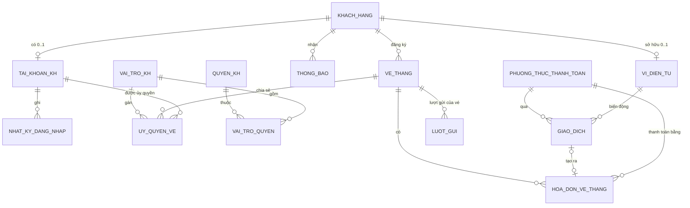

# KẾ HOẠCH NÂNG CẤP CSDL: CỔNG KHÁCH HÀNG VÉ THÁNG (CUSTOMER PORTAL)

> **Phạm vi:** Bổ sung tài khoản đăng nhập cho khách hàng vé tháng, ví điện tử để tự nạp tiền và gia hạn, lịch sử đỗ xe, lịch sử giao dịch (số tiền, phương thức thanh toán, trạng thái…), cùng cơ chế phân quyền riêng cho tài khoản khách hàng.
> **Nền tảng:** Microsoft SQL Server 2022 (T-SQL), Flask. Nâng cấp **tăng dần** trên CSDL `QuanLyBaiDoXe` hiện có (5 bãi, 11 bảng, 6 procedures, 8 triggers, 3 functions, 2 cursors, 21 views).
> **Nguyên tắc:** không phá vỡ các chức năng và 10 kịch bản demo hiện tại. **Mọi thay đổi CSDL có ảnh hưởng tới màn hình đều phải kèm cập nhật UI** theo design system hiện có (mục 12). Mọi thay đổi trên bảng cũ chỉ **thêm cột cho phép NULL hoặc có DEFAULT**, không đổi tên và không xóa cột. Dữ liệu mẫu đi qua file Excel nguồn chuẩn `docs/QuanLyBaiDoXe_DuLieuMau.xlsx`.

### Lịch sử cập nhật

| Ngày | Nội dung |
|---|---|
| 2026-09-30 | Bản đầu tiên (commit `51b071c`) |
| 2026-10-07 | **Xử lý N4** (cấp lại thẻ cho vé mới, hàm `f_VeHienHanhCuaThe`, mã lỗi 50065 / 50066) và **N5** (salt SHA2_512 cho mật khẩu nhân viên). Kiểm thử trên SQL Server 2022: full script 0 lỗi, 20/20 ca N4 / N5, 19/19 kịch bản demo không đổi kết quả |
| 2026-10-06 (e) | **Triển khai GĐ 5** (cổng khách hàng `/kh`) và **chạy thử trên SQL Server 2022 thật**: full script 0 lỗi, 19/19 kịch bản demo đúng kết quả mong đợi, smoke test cổng khách hàng 40/40. Thêm 5 view + 1 thủ tục phục vụ cổng, chặn nạp tiền mặt online, tắt ODBC pooling (rò `SESSION_CONTEXT` / `EXECUTE AS` giữa các kết nối) |
| 2026-10-06 (d) | Gộp module 10–17 vào 01–08 (mục 13.1); rà soát logic: hoàn tiền chỉ cho khoản chưa gắn hóa đơn, ủy quyền quá `NgayKetThuc` không tính vào giới hạn, chống trùng thông báo tự gia hạn thất bại, `SECRET_KEY` đọc từ `.env` (N7 một phần) |
| 2026-10-06 (c) | **Triển khai GĐ 0 → 4b** (chưa commit, chưa chạy thử trên SQL Server thật). Xem mục "Trạng thái triển khai" ngay dưới bảng này |
| 2026-10-06 (b) | Bổ sung yêu cầu **cập nhật giao diện** cho mọi phần có liên quan: viết lại mục 12 (nguyên tắc UI, ma trận ảnh hưởng, màn hình nhân viên, cổng khách hàng, hiển thị dữ liệu, bản đồ mã lỗi); thêm dòng "→ UI" ở các mục 3, 5, 7, 8, 9, 10, 11; bổ sung việc UI vào lộ trình, kiểm thử và nghiệm thu. Ghi nhận lỗi hiển thị có sẵn: `SoThangGiaHan` đang bị định dạng thành tiền (N11) |
| 2026-10-06 (a) | Đồng bộ với commit `be9c15d` (seed từ Excel, 5 bãi, quy tắc vé gắn bãi / vé `ALL`, sửa `sp_GiaHanTheThang`, `sp_DangKyThanhVien`, `trg_KiemTraCheckIn`): cập nhật số liệu hiện trạng; đánh dấu nợ kỹ thuật đã xử lý; giá gia hạn online của vé `ALL` theo quy tắc của nhóm (D12); dữ liệu mẫu mới đi qua Excel (D11, mục 11); dùng lại cơ chế sinh mã của nhóm (D9); bổ sung yêu cầu transaction lồng nhau cho `sp_GiaHanVe_Core`; chỉnh dữ liệu của kịch bản demo theo seed mới |


### Trạng thái triển khai (2026-10-06)

| Giai đoạn | Trạng thái | Kết quả |
|---|---|---|
| GĐ 0 | ✅ Xong (trừ N8) | `tools/build_fullscript.py` sinh lại full script từ module (sửa N6); mã lỗi trigger `50007` → `50009` (N1); `01_schema.sql` gỡ được đối tượng cổng khách hàng khi reset. **N8 chưa xử lý**: chưa có script sinh seed từ Excel |
| GĐ 1 – 3 | ✅ Xong, **đã chạy trên SQL Server 2022** | Phần cổng khách hàng của `sql/01` → `sql/08` (gộp từ 10 → 17). Full script nạp 0 lỗi; 19 kịch bản demo chạy đúng trên CSDL thử `QuanLyBaiDoXe_Test` |
| GĐ 4a | ✅ Xong | 19 kịch bản demo; `/tables` (21 bảng, nhóm + tìm kiếm), `/reports` (23 view, nhóm + tìm kiếm), bốt cổng, `/setup` đếm object thực, SQL Studio, hiển thị dữ liệu dùng chung (sửa N11) |
| GĐ 4b | ✅ Xong | `/khach-hang` (3 tab, mở khóa / nạp tại quầy / hoàn tiền có xác nhận), KPI trang chủ, `app/errors.py` |
| GĐ 5 | ✅ Xong | `app/kh_routes.py` + `app/templates/kh/` (layout riêng + 12 màn hình): đăng nhập (có bảng tài khoản demo), đăng ký, tổng quan, chi tiết vé, gia hạn, nạp tiền, cổng thanh toán mô phỏng, lịch sử đỗ xe, sao kê ví, thông báo, chia sẻ vé, bảo mật. CSRF, hết phiên 30 phút, cookie `HttpOnly` + `SameSite=Lax`. Kiểm thử ở 1440 / 390 px, Sáng / Tối |

**Khác biệt so với kế hoạch khi triển khai:**
- **Đặt tên và danh tính:** thủ tục khách hàng đặt tên `dbo.sp_KH_*` (không dùng schema `kh`). Chúng chạy `WITH EXECUTE AS OWNER` và lấy danh tính từ `SESSION_CONTEXT('MaTK')`, không nhận tham số `@MaTK`, nên không giả mạo được.
- **DENY theo từng bảng:** lớp 1 DENY trên từng bảng thay vì cả schema `dbo` (R2 không còn phát sinh).
- **Danh mục tra cứu ở file 10:** PTTT, quyền và vai trò nạp ở file 10 (không phải 11), vì khóa ngoại của cột `HOA_DON_VE_THANG.MaPTTT` cần dữ liệu cha.
- **Ghi đè thủ tục và view V6:** `sp_GiaHanTheThang`, `sp_DangKyThanhVien`, `sp_XeVaoBai`, 2 cursor và 2 view có bản mở rộng; sau khi gộp module chỉ còn bản mở rộng (view được đặt đúng vị trí cũ vì có view phía sau phụ thuộc).
- **Đối tượng phụ thêm ngoài kế hoạch:** `sp_SinhMaGiaoDich` (`NEXT VALUE FOR` không dùng được trong function), `f_KH_MatKhauHopLe`, `f_KH_MaTKPhien`.
- **Không tạo block predicate RLS:** khách bị DENY ghi trên mọi bảng, mọi thao tác ghi đi qua `sp_KH_*` (`EXECUTE AS OWNER` + `f_KH_CoQuyen`), nên block predicate không thêm lớp chặn nào.
- **Hoàn tiền (`sp_NV_HoanTien`):** chỉ hoàn khoản thanh toán chưa gắn hóa đơn (trừ trùng / trừ nhầm, mã 50063). Khoản đã xuất hóa đơn thì vé đã được cộng hạn và doanh thu đã ghi nhận, hoàn tiền sẽ làm lệch cả hai.
- **Ủy quyền hết hạn:** không có trạng thái riêng; ủy quyền quá `NgayKetThuc` không được tính vào giới hạn 3 người và kiểm tra trùng (50049).
- **Kết nối của cổng `/kh` (`get_kh_connection`):** mỗi request mở một kết nối autocommit (nhật ký đăng nhập sai không bị rollback nên cơ chế khóa tài khoản hoạt động), đặt `SESSION_CONTEXT` read-only rồi `EXECUTE AS USER = 'u_WebKhachHang'`; có `SQLSERVER_KH_USERNAME` thì dùng login riêng thay cho `EXECUTE AS` (phần còn lại của N7). Luôn gọi `sp_KH_DangNhap` với `@KhoaNguCanh = 1`.
- **Tắt ODBC connection pooling (`app/db.py`):** đã kiểm chứng trên SQL Server 2022 là kết nối pooled giữ nguyên `SESSION_CONTEXT` và `EXECUTE AS` sang lần mở kế tiếp, khiến trang nhân viên chạy dưới quyền khách (và các demo đăng nhập để lại ngữ cảnh phiên). Chi phí mở kết nối mới khoảng 25 ms.
- **Đối tượng thêm cho cổng:** `vw_KH_NhatKyDangNhap`, `vw_KH_PhuongThucNapVi`, `vw_KH_HanMucNap`, `vw_KH_QuyenTrenVe`, `vw_KH_VaiTroUyQuyen` và `sp_KH_DanhSachUyQuyen` (`EXECUTE AS OWNER` vì RLS trên `TAI_KHOAN_KH` ẩn tài khoản người nhận / chủ vé khác). Tổng: 37 view, 23 thủ tục (+4 cursor).
- **Nạp tiền mặt chỉ tại quầy:** `sp_KH_NapTien_KhoiTao` loại phương thức kênh *Tiền mặt* (trước đây khách tạo được lệnh nạp tiền mặt online chờ cổng thanh toán xác nhận).
- **Cổng thanh toán mô phỏng:** callback `sp_KH_NapTien_XacNhan` chạy bằng kết nối hệ thống (khách bị DENY), mã tham chiếu cố định `SIM-<MaGD>` để nút "Gửi lại callback" minh họa idempotency.
- **Lõi gia hạn:** `sp_GiaHanVe_Core` dùng mẫu transaction lồng an toàn (N9).
- **8 trigger thay vì 7:** tách `trg_GiaoDich_ChanXoa` (INSTEAD OF DELETE) khỏi `trg_GiaoDich_BatBien` (AFTER UPDATE), vì một trigger không thể vừa INSTEAD OF vừa AFTER.
- **Thêm mã lỗi:** `50054` (vé hết hạn không được chia sẻ) và `50064` (thanh toán bằng số dư ví phải có giao dịch).
- **Dữ liệu mẫu:** file 11 tạm viết tay. Ví KH0006 = 2.600.000 ₫ (có chuỗi trừ trùng và hoàn tiền); thêm 2 lượt gửi của V0004 cho demo ủy quyền.
- **Màn hình `/khach-hang`:** chưa có bộ chọn bãi (tài khoản không gắn với một bãi duy nhất); dùng ô tìm kiếm thay thế.
- **N4, N5:** đã xử lý ngày 2026-10-07 (xem mục 15). Còn lại N8 (script sinh seed từ Excel).
- **Đã kiểm thử trên SQL Server 2022 thật (2026-10-06):** nạp full script 0 lỗi; 19/19 kịch bản (kể cả 16 RLS và 19 trigger ROLLBACK trong TRY/CATCH); smoke test cổng `/kh` 40 ca (RLS, CSRF, nạp 2 pha + callback lặp, gia hạn, thiếu số dư, quyền người được ủy quyền, khóa sau 5 lần sai, không rò quyền sang trang nhân viên).

---

## Mục lục

1. [Hiện trạng và vấn đề cần giải quyết](#1-hiện-trạng-và-vấn-đề-cần-giải-quyết)
2. [Quyết định thiết kế chính](#2-quyết-định-thiết-kế-chính)
3. [Thiết kế Schema mới](#3-thiết-kế-schema-mới)
4. [Cơ chế phân quyền tài khoản khách hàng](#4-cơ-chế-phân-quyền-tài-khoản-khách-hàng)
5. [Stored Procedures](#5-stored-procedures)
6. [Functions](#6-functions)
7. [Triggers](#7-triggers)
8. [Cursors](#8-cursors)
9. [Views](#9-views)
10. [Kịch bản Demo mới (chuẩn 5 bước)](#10-kịch-bản-demo-mới-chuẩn-5-bước)
11. [Dữ liệu mẫu bổ sung](#11-dữ-liệu-mẫu-bổ-sung)
12. [Cập nhật giao diện và ứng dụng Web](#12-cập-nhật-giao-diện-và-ứng-dụng-web)
13. [Lộ trình triển khai và tổ chức file SQL](#13-lộ-trình-triển-khai-và-tổ-chức-file-sql)
14. [Kiểm thử và tiêu chí nghiệm thu](#14-kiểm-thử-và-tiêu-chí-nghiệm-thu)
15. [Rủi ro và nợ kỹ thuật xử lý kèm](#15-rủi-ro-và-nợ-kỹ-thuật-xử-lý-kèm)

---

## 1. Hiện trạng và vấn đề cần giải quyết

| Nhu cầu | Hiện trạng trong CSDL | Hạn chế |
|---|---|---|
| Khách hàng đăng nhập | `TAI_KHOAN.MaNV` là `NOT NULL` và có FK tới `NHAN_VIEN`, nên bảng này chỉ dành cho nhân viên | Khách hàng không thể có tài khoản |
| Tự nạp tiền | Không có khái niệm số dư hoặc ví | Mọi khoản thu đều phải làm tại quầy |
| Tự gia hạn vé tháng | `sp_GiaHanTheThang` đã chạy trong transaction và tính giá đúng bãi (vé gắn bãi: bãi áp dụng; vé `ALL`: `@MaBaiGiaHan` hoặc bãi phát hành thẻ), nhưng chỉ cấp cho nhân viên (`r_QuanLyBai`) và mặc định coi mọi khoản thu là tiền mặt tại quầy | Khách không tự gia hạn được; không ghi nhận phương thức thanh toán hoặc kênh; chưa gọi được từ một transaction bên ngoài (xem N9) |
| Lịch sử giao dịch | `HOA_DON_VE_THANG` chỉ có `SoTien`, `NgayThanhToan` | Không có phương thức thanh toán, trạng thái, mã tham chiếu cổng thanh toán, số dư trước/sau |
| Lịch sử đỗ xe | `LUOT_GUI` chỉ có `MaThe`. Muốn biết khách nào phải JOIN qua `VE_THANG.MaThe` | Sai lịch sử khi thẻ được cấp lại cho vé khác; `UQ_VeThang_MaThe` còn khiến thẻ không thể tái sử dụng |
| Phân quyền khách hàng | RBAC chỉ có 3 vai trò nhân viên: `r_Admin`, `r_QuanLyBai`, `r_BaoVe` | Không có cơ chế bảo đảm khách A không xem được dữ liệu của khách B |

---

## 2. Quyết định thiết kế chính

Các quyết định dưới đây đã được chốt để lập kế hoạch. Mỗi mục ghi kèm lý do và có thể điều chỉnh trước khi bắt đầu Giai đoạn 1.

| # | Quyết định | Lý do |
|---|---|---|
| D1 | Tạo **bảng riêng `TAI_KHOAN_KH`** cho khách hàng, không gộp vào `TAI_KHOAN` | Tách biệt miền bảo mật nhân viên và khách hàng. Không phải sửa `sp_DangNhap` và các FK hiện có; tránh để khách hàng bị nhầm cấp quyền nhân viên |
| D2 | Mô hình **ví trả trước (`VI_DIEN_TU`)**: khách nạp tiền vào ví, sau đó dùng số dư để gia hạn | Tách 2 nghiệp vụ "thu tiền từ cổng thanh toán" và "trừ tiền dịch vụ", giúp đối soát dễ hơn và minh họa rõ transaction và trigger |
| D3 | **Sổ cái giao dịch bất biến (`GIAO_DICH`)**: mọi biến động số dư đều là một dòng giao dịch; không sửa, không xóa | Chuẩn kế toán (append-only ledger), phục vụ truy vết và đối soát |
| D4 | **Số dư ví chỉ được cập nhật bởi trigger** khi giao dịch chuyển sang `Thành công` | Một nguồn sự thật duy nhất. Không procedure nào được `UPDATE VI_DIEN_TU.SoDu` trực tiếp (dùng `DENY` để chặn) |
| D5 | Nạp tiền theo **2 pha**: khởi tạo (`Chờ xử lý`) rồi xác nhận từ cổng thanh toán, có **idempotency** theo `MaThamChieu` | Mô phỏng đúng luồng MoMo/VNPay; bảo đảm callback gọi lặp không cộng tiền 2 lần |
| D6 | Phân quyền khách hàng gồm **3 lớp**: DB role `r_KhachHang` + Row-Level Security + quyền nghiệp vụ theo vai trò và ủy quyền | Lớp DB chặn truy cập bảng gốc; RLS cô lập dữ liệu từng khách; lớp nghiệp vụ cho phép chia sẻ vé (ví dụ người nhà) với quyền hạn chế |
| D7 | Mật khẩu khách hàng dùng **SHA2_512 + salt ngẫu nhiên 16 byte** (`CRYPT_GEN_RANDOM`) | Mạnh hơn SHA2_256 không salt đang dùng cho nhân viên. Tài khoản nhân viên giữ nguyên, việc nâng cấp để ở mục [15](#15-rủi-ro-và-nợ-kỹ-thuật-xử-lý-kèm) |
| D8 | Chỉ khách hàng **đã có hồ sơ `KHACH_HANG`** (đã từng đăng ký vé tại quầy) mới được tự tạo tài khoản, xác minh bằng SĐT và CCCD | Tránh tài khoản rác; đăng ký vé mới vẫn làm tại quầy vì phải cấp thẻ vật lý |
| D9 | Sinh mã: **dùng lại quy ước của nhóm** (MAX + 1 trong transaction với `UPDLOCK, HOLDLOCK`, như `KH####`, `V####`, `HD+yyyyMMdd+STT` ở `be9c15d`) cho `TAI_KHOAN_KH` (`TK####`) và `VI_DIEN_TU` (`VI####`). Riêng `GIAO_DICH` dùng **`SEQUENCE`** | Thống nhất một kiểu mã với code hiện có. `GIAO_DICH` ghi nhiều và đồng thời (nạp tiền, callback, cursor), nên MAX + 1 sẽ khóa cả bảng và thành nút thắt |
| D10 | Dải mã lỗi mới: **50030 – 50069** | Các mã đang dùng: 50001–50008, 50010–50022. Mã `50007` vẫn đang trùng (xem N1) |
| D11 | **Dữ liệu mẫu của 10 bảng mới nằm trong Excel master** (sheet mới + cờ `KT_*`), sinh ra `11_upgrade_sample_data.sql`, không viết tay | Theo quy ước của nhóm từ `be9c15d`: Excel là nguồn chuẩn, sheet `KiemTra` phải ĐẠT hết trước khi sinh seed |
| D12 | **Giá gia hạn online** theo đúng quy tắc tại quầy: vé gắn bãi tính giá tại bãi áp dụng; vé `ALL` tính giá tại **bãi phát hành thẻ** (online không có "bãi bán vé") | Một quy tắc giá duy nhất cho mọi kênh; trùng với mặc định `@MaBaiGiaHan = NULL` của `sp_GiaHanTheThang` |

---

## 3. Thiết kế Schema mới

### 3.1. Sơ đồ quan hệ (ERD phần mở rộng)



### 3.2. Bảng mới (10 bảng, tổng sau nâng cấp: 21 bảng)

#### (12) `PHUONG_THUC_THANH_TOAN`: Danh mục phương thức thanh toán

| Cột | Kiểu | Ràng buộc | Ghi chú |
|---|---|---|---|
| `MaPTTT` | `VARCHAR(20)` | PK | `TIEN_MAT`, `CHUYEN_KHOAN`, `MOMO`, `ZALOPAY`, `VNPAY`, `THE_NH`, `SO_DU_VI` |
| `TenPTTT` | `NVARCHAR(100)` | NOT NULL, UNIQUE | Tên hiển thị |
| `LoaiKenh` | `NVARCHAR(30)` | CHECK IN (`Tiền mặt`, `Ngân hàng`, `Ví điện tử`, `Thẻ`, `Số dư ví`) | |
| `PhiPhanTram` | `DECIMAL(5,2)` | DEFAULT 0, CHECK 0–10 | Phí cổng thanh toán (dùng cho báo cáo doanh thu thuần) |
| `SoTienToiThieu` | `DECIMAL(18,2)` | DEFAULT 10000 | Hạn mức nạp tối thiểu |
| `ChoPhepNapVi` | `BIT` | DEFAULT 1 | `SO_DU_VI` = 0 (không thể dùng ví để nạp vào ví) |
| `TrangThai` | `NVARCHAR(20)` | CHECK IN (`Hoạt động`, `Tạm ngưng`) | Tạm ngưng khi cổng bảo trì |

#### (13) `TAI_KHOAN_KH`: Tài khoản đăng nhập của khách hàng

| Cột | Kiểu | Ràng buộc | Ghi chú |
|---|---|---|---|
| `MaTK` | `VARCHAR(12)` | PK | Dạng `TK####`, sinh MAX + 1 như `KH####` (D9) |
| `MaKH` | `VARCHAR(10)` | NOT NULL, **UNIQUE**, FK → `KHACH_HANG` | Mỗi khách có tối đa 1 tài khoản |
| `TenDangNhap` | `VARCHAR(100)` | NOT NULL, UNIQUE | SĐT hoặc email |
| `MatKhauHash` | `VARBINARY(64)` | NOT NULL | `HASHBYTES('SHA2_512', Salt + MatKhau)` |
| `MatKhauSalt` | `VARBINARY(16)` | NOT NULL | `CRYPT_GEN_RANDOM(16)` |
| `TrangThai` | `NVARCHAR(20)` | DEFAULT `Hoạt động`, CHECK IN (`Hoạt động`, `Tạm khóa`, `Đã đóng`) | |
| `SoLanSaiLienTiep` | `TINYINT` | DEFAULT 0 | Reset về 0 khi đăng nhập đúng |
| `KhoaDen` | `DATETIME` | NULL | Khóa tạm thời có thời hạn (ví dụ 15 phút) |
| `NgayTao` | `DATETIME` | DEFAULT `GETDATE()` | |
| `LanDangNhapCuoi` | `DATETIME` | NULL | |

#### (14) `NHAT_KY_DANG_NHAP`: Nhật ký đăng nhập (audit bảo mật)

| Cột | Kiểu | Ràng buộc | Ghi chú |
|---|---|---|---|
| `MaNK` | `BIGINT IDENTITY` | PK | |
| `MaTK` | `VARCHAR(12)` | NULL, FK → `TAI_KHOAN_KH` | NULL nếu tên đăng nhập không tồn tại |
| `TenDangNhapNhap` | `VARCHAR(100)` | NOT NULL | Giá trị người dùng đã gõ |
| `ThoiGian` | `DATETIME` | DEFAULT `GETDATE()` | |
| `KetQua` | `NVARCHAR(20)` | CHECK IN (`Thành công`, `Sai mật khẩu`, `Không tồn tại`, `Bị khóa`) | |
| `DiaChiIP` | `VARCHAR(45)` | NULL | Hỗ trợ IPv6 |
| `ThietBi` | `NVARCHAR(200)` | NULL | User-Agent |

Chỉ mục: `IX_NhatKy_MaTK_ThoiGian (MaTK, ThoiGian DESC)`, phục vụ trigger đếm số lần sai.

#### (15) `VI_DIEN_TU`: Ví trả trước của khách hàng

| Cột | Kiểu | Ràng buộc | Ghi chú |
|---|---|---|---|
| `MaVi` | `VARCHAR(12)` | PK | Dạng `VI####`, sinh MAX + 1 (D9) |
| `MaKH` | `VARCHAR(10)` | NOT NULL, **UNIQUE**, FK → `KHACH_HANG` | |
| `SoDu` | `DECIMAL(18,2)` | DEFAULT 0, **CHECK (SoDu >= 0)** | Chặn số dư âm ở mức ràng buộc |
| `HanMucNapNgay` | `DECIMAL(18,2)` | DEFAULT 20000000 | Chống rửa tiền hoặc gian lận |
| `TrangThai` | `NVARCHAR(20)` | CHECK IN (`Hoạt động`, `Đóng băng`) | Đóng băng khi có tranh chấp |
| `NgayTao` | `DATETIME` | DEFAULT `GETDATE()` | |
| `PhienBan` | `ROWVERSION` | | Phát hiện cập nhật đồng thời (optimistic concurrency) |

#### (16) `GIAO_DICH`: Sổ cái giao dịch ví (append-only)

| Cột | Kiểu | Ràng buộc | Ghi chú |
|---|---|---|---|
| `MaGD` | `VARCHAR(16)` | PK | `GD2610000001` (từ `seq_GiaoDich`) |
| `MaVi` | `VARCHAR(12)` | NOT NULL, FK → `VI_DIEN_TU` | |
| `LoaiGD` | `NVARCHAR(30)` | CHECK IN (`Nạp tiền`, `Thanh toán vé tháng`, `Hoàn tiền`, `Điều chỉnh`) | |
| `HuongTien` | `SMALLINT` | CHECK IN (1, -1) | +1 cộng ví, -1 trừ ví |
| `SoTien` | `DECIMAL(18,2)` | CHECK (SoTien > 0) | Luôn dương, chiều tiền nằm ở `HuongTien` |
| `PhiGiaoDich` | `DECIMAL(18,2)` | DEFAULT 0 | Phí cổng thanh toán, do công ty chịu |
| `SoDuTruoc` | `DECIMAL(18,2)` | NULL | Trigger ghi lại khi giao dịch thành công |
| `SoDuSau` | `DECIMAL(18,2)` | NULL | Trigger ghi lại khi giao dịch thành công |
| `MaPTTT` | `VARCHAR(20)` | NOT NULL, FK → `PHUONG_THUC_THANH_TOAN` | Thanh toán bằng ví thì dùng `SO_DU_VI` |
| `MaThamChieu` | `VARCHAR(64)` | NULL | Mã giao dịch phía cổng thanh toán. **Unique index có lọc `WHERE MaThamChieu IS NOT NULL`** (idempotency) |
| `TrangThai` | `NVARCHAR(20)` | CHECK IN (`Chờ xử lý`, `Thành công`, `Thất bại`, `Đã hoàn`) | |
| `MaVe` | `VARCHAR(10)` | NULL, FK → `VE_THANG` | Có giá trị khi `LoaiGD = Thanh toán vé tháng` |
| `MaGDGoc` | `VARCHAR(16)` | NULL, FK → `GIAO_DICH` (tự tham chiếu) | Giao dịch hoàn tiền trỏ về giao dịch gốc |
| `NguoiThucHien` | `NVARCHAR(20)` | CHECK IN (`Khách hàng`, `Nhân viên`, `Hệ thống`) | |
| `MaNV` | `VARCHAR(10)` | NULL, FK → `NHAN_VIEN` | Nhân viên thực hiện hoàn tiền hoặc điều chỉnh |
| `ThoiGianTao` | `DATETIME` | DEFAULT `GETDATE()` | |
| `ThoiGianHoanTat` | `DATETIME` | NULL | |
| `GhiChu` | `NVARCHAR(255)` | NULL | Lý do thất bại hoặc hoàn tiền |

Ràng buộc bổ sung:
- `CK_GD_HuongTien_Loai`: `(LoaiGD IN (N'Nạp tiền', N'Hoàn tiền') AND HuongTien = 1) OR (LoaiGD = N'Thanh toán vé tháng' AND HuongTien = -1) OR LoaiGD = N'Điều chỉnh'`
- `CK_GD_VeThang`: `LoaiGD <> N'Thanh toán vé tháng' OR MaVe IS NOT NULL`
- Chỉ mục: `IX_GiaoDich_MaVi_ThoiGian (MaVi, ThoiGianTao DESC) INCLUDE (LoaiGD, SoTien, TrangThai)`

#### (17) `THONG_BAO`: Hộp thư thông báo của khách hàng

| Cột | Kiểu | Ràng buộc | Ghi chú |
|---|---|---|---|
| `MaTB` | `BIGINT IDENTITY` | PK | |
| `MaKH` | `VARCHAR(10)` | NOT NULL, FK → `KHACH_HANG` | |
| `LoaiTB` | `NVARCHAR(30)` | CHECK IN (`Giao dịch`, `Sắp hết hạn`, `Hết hạn`, `Bảo mật`, `Ủy quyền`, `Hệ thống`) | |
| `TieuDe` | `NVARCHAR(150)` | NOT NULL | |
| `NoiDung` | `NVARCHAR(1000)` | NOT NULL | |
| `MaVe` / `MaGD` | `VARCHAR` | NULL, FK | Liên kết ngữ cảnh |
| `DaDoc` | `BIT` | DEFAULT 0 | |
| `ThoiGianTao` | `DATETIME` | DEFAULT `GETDATE()` | |

#### (18) `QUYEN_KH`: Danh mục quyền nghiệp vụ khách hàng

| `MaQuyen` (PK) | Mô tả |
|---|---|
| `VE.XEM` | Xem thông tin vé tháng, hạn dùng |
| `LICHSU.XEM` | Xem lịch sử đỗ xe của vé |
| `VE.GIAHAN` | Gia hạn vé bằng số dư ví |
| `VE.BAOMAT` | Báo mất thẻ của vé (khóa thẻ ngay) |
| `VI.XEM` | Xem số dư và sao kê ví |
| `VI.NAPTIEN` | Nạp tiền vào ví |
| `GIAODICH.XEM` | Xem lịch sử giao dịch |
| `VE.UYQUYEN` | Chia sẻ hoặc thu hồi quyền trên vé cho tài khoản khác |
| `VE.TUDONGGIAHAN` | Bật/tắt tự động gia hạn |

#### (19) `VAI_TRO_KH` và (20) `VAI_TRO_QUYEN`: Vai trò khách hàng và ma trận quyền

| Quyền \ Vai trò | `CHU_SO_HUU` (chủ vé) | `THANH_VIEN` (người nhà, tài xế) | `XEM_LICH_SU` (kế toán doanh nghiệp, chỉ xem) |
|---|:---:|:---:|:---:|
| `VE.XEM` | ✅ | ✅ | ✅ |
| `LICHSU.XEM` | ✅ | ✅ | ✅ |
| `VE.BAOMAT` | ✅ | ✅ | ❌ |
| `VE.GIAHAN` | ✅ | ❌ | ❌ |
| `VE.TUDONGGIAHAN` | ✅ | ❌ | ❌ |
| `VE.UYQUYEN` | ✅ | ❌ | ❌ |
| `VI.XEM`, `VI.NAPTIEN`, `GIAODICH.XEM` | ✅ (ví của chính mình) | ✅ (ví của chính mình) | ✅ (ví của chính mình) |

- `VAI_TRO_KH (MaVaiTro PK, TenVaiTro, MoTa)`
- `VAI_TRO_QUYEN (MaVaiTro FK, MaQuyen FK, PK(MaVaiTro, MaQuyen))`
- `CHU_SO_HUU` **không lưu trong bảng ủy quyền**. Hệ thống suy ra vai trò này khi `VE_THANG.MaKH` = `MaKH` của tài khoản.
- Quyền về ví luôn chỉ áp dụng trên ví của chính tài khoản đó. Ủy quyền vé không bao giờ cho phép dùng ví của người khác.

#### (21) `UY_QUYEN_VE`: Ủy quyền chia sẻ vé giữa các tài khoản

| Cột | Kiểu | Ràng buộc | Ghi chú |
|---|---|---|---|
| `MaUyQuyen` | `INT IDENTITY` | PK | |
| `MaVe` | `VARCHAR(10)` | NOT NULL, FK → `VE_THANG` | |
| `MaTKDuocUyQuyen` | `VARCHAR(12)` | NOT NULL, FK → `TAI_KHOAN_KH` | |
| `MaVaiTro` | `VARCHAR(20)` | NOT NULL, FK → `VAI_TRO_KH`, CHECK ≠ `CHU_SO_HUU` | |
| `NgayBatDau` | `DATE` | DEFAULT hôm nay | |
| `NgayKetThuc` | `DATE` | NULL, CHECK ≥ `NgayBatDau` | NULL = vô thời hạn |
| `TrangThai` | `NVARCHAR(20)` | CHECK IN (`Hiệu lực`, `Đã thu hồi`) | |
| `MaTKCap` | `VARCHAR(12)` | NOT NULL, FK → `TAI_KHOAN_KH` | Chủ vé thực hiện cấp quyền |
| `NgayTao` | `DATETIME` | DEFAULT `GETDATE()` | |

Unique index có lọc: `UX_UyQuyen_HieuLuc (MaVe, MaTKDuocUyQuyen) WHERE TrangThai = N'Hiệu lực'`.

### 3.3. Thay đổi trên bảng hiện có (chỉ thêm cột, an toàn ngược)

| Bảng | Cột thêm | Kiểu / Ràng buộc | Backfill dữ liệu cũ |
|---|---|---|---|
| `HOA_DON_VE_THANG` | `MaPTTT` | `VARCHAR(20) NOT NULL DEFAULT 'TIEN_MAT'`, FK | Tự động nhận DEFAULT `TIEN_MAT` |
| | `KenhThanhToan` | `NVARCHAR(20) NOT NULL DEFAULT N'Tại quầy'`, CHECK IN (`Tại quầy`, `Online`, `Tự động`) | `Tại quầy` |
| | `MaGD` | `VARCHAR(16) NULL`, FK → `GIAO_DICH`, unique index có lọc | NULL |
| | `MaNVThu` | `VARCHAR(10) NULL`, FK → `NHAN_VIEN` | NULL |
| `VE_THANG` | `TuDongGiaHan` | `BIT NOT NULL DEFAULT 0` | 0 |
| | `SoThangTuDongGiaHan` | `TINYINT NOT NULL DEFAULT 1`, CHECK 1–12 | 1 |
| `LUOT_GUI` | `MaVe` | `VARCHAR(10) NULL`, FK → `VE_THANG` | `UPDATE lg SET MaVe = vt.MaVe FROM LUOT_GUI lg JOIN VE_THANG vt ON vt.MaThe = lg.MaThe AND CAST(lg.ThoiGianVao AS DATE) BETWEEN vt.NgayDangKy AND vt.NgayHetHan` |
| `KHACH_HANG` | `NgayTao` | `DATETIME NOT NULL DEFAULT GETDATE()` | Thời điểm chạy migration |

Chỉ mục mới: `IX_LuotGui_MaVe_ThoiGianVao (MaVe, ThoiGianVao DESC) WHERE MaVe IS NOT NULL` (lịch sử đỗ xe theo vé).

> **→ UI (mục 12.2, 12.5):**
> - `/tables` tăng từ 11 lên 21 bảng, cần nhóm theo phân hệ và có ô tìm kiếm.
> - `_result_table.html` phải hiển thị đúng các cột mới: tiền có dấu, badge trạng thái/kênh/PTTT, ẩn cột `VARBINARY` mật khẩu.
> - Bốt cổng hiển thị `MaVe` của lượt đang mở.

### 3.4. Sequences

Chỉ `GIAO_DICH` dùng sequence (D9). Các mã khác giữ quy ước MAX + 1 của nhóm; mã hóa đơn vẫn do `sp_GiaHanTheThang` / `sp_DangKyThanhVien` sinh (`HD+yyyyMMdd+STT`).

```sql
CREATE SEQUENCE dbo.seq_GiaoDich AS BIGINT START WITH 1 INCREMENT BY 1;
-- MaGD = 'GD' + FORMAT(GETDATE(),'yyMM') + RIGHT('00000000' + CAST(NEXT VALUE FOR dbo.seq_GiaoDich AS VARCHAR(20)), 8)
-- Seed: sinh MaGD cố định từ Excel, rồi ALTER SEQUENCE dbo.seq_GiaoDich RESTART WITH <số lớn nhất + 1> ở cuối file 11.
```

---

## 4. Cơ chế phân quyền tài khoản khách hàng

Kiến trúc phòng thủ nhiều lớp (defense-in-depth). Mỗi lớp chặn một loại tấn công khác nhau:

```
 Khách hàng (Web)  ──►  Flask (kết nối bằng login riêng: login_WebKhachHang)
                          │  1. sp_KH_DangNhap xác thực
                          │  2. EXEC sp_set_session_context 'MaTK', 'MaKH' (read_only = 1)
                          ▼
 ┌────────────────────────────────────────────────────────────────────────┐
 │ LỚP 1 · DB ROLE r_KhachHang                                            │
 │   GRANT EXECUTE chỉ trên sp_KH_* ; GRANT SELECT chỉ trên vw_KH_*       │
 │   DENY SELECT/INSERT/UPDATE/DELETE trên mọi bảng gốc                   │
 │   → Không thể SELECT * FROM GIAO_DICH hoặc UPDATE VI_DIEN_TU trực tiếp │
 ├────────────────────────────────────────────────────────────────────────┤
 │ LỚP 2 · ROW-LEVEL SECURITY (Security Policy rls_KhachHang)             │
 │   Filter predicate theo SESSION_CONTEXT('MaKH') trên VE_THANG,         │
 │   VI_DIEN_TU, GIAO_DICH, THONG_BAO, LUOT_GUI, HOA_DON_VE_THANG         │
 │   Block predicate AFTER INSERT/UPDATE trên GIAO_DICH, UY_QUYEN_VE      │
 │   → Dù viết sai WHERE, khách A vẫn không bao giờ thấy dòng của khách B │
 ├────────────────────────────────────────────────────────────────────────┤
 │ LỚP 3 · QUYỀN NGHIỆP VỤ (f_KH_CoQuyen + VAI_TRO_QUYEN + UY_QUYEN_VE)    │
 │   Mỗi sp_KH_* gọi f_KH_CoQuyen(@MaTK, @MaQuyen, @MaVe) ở dòng đầu      │
 │   → Người được ủy quyền "THANH_VIEN" xem được lịch sử nhưng không gia hạn │
 └────────────────────────────────────────────────────────────────────────┘
```

### 4.1. Lớp 1: Database role và user

```sql
CREATE ROLE r_KhachHang;
CREATE USER u_WebKhachHang WITHOUT LOGIN;   -- demo; triển khai thật thì map với login_WebKhachHang
ALTER ROLE r_KhachHang ADD MEMBER u_WebKhachHang;

GRANT EXECUTE ON dbo.sp_KH_DangNhap, dbo.sp_KH_DangKyTaiKhoan, dbo.sp_KH_DoiMatKhau,
                 dbo.sp_KH_NapTien_KhoiTao, dbo.sp_KH_GiaHanBangVi, dbo.sp_KH_UyQuyenVe,
                 dbo.sp_KH_ThuHoiUyQuyen, dbo.sp_KH_CaiDatTuDongGiaHan, dbo.sp_KH_BaoMatThe,
                 dbo.sp_KH_DanhDauDaDoc TO r_KhachHang;
GRANT SELECT ON dbo.vw_KH_HoSoCuaToi, dbo.vw_KH_VeThangCuaToi, dbo.vw_KH_LichSuDoXe,
                dbo.vw_KH_LichSuGiaoDich, dbo.vw_KH_HoaDonCuaToi, dbo.vw_KH_ThongBao TO r_KhachHang;
GRANT SELECT ON dbo.f_KH_SaoKeVi TO r_KhachHang;

DENY SELECT, INSERT, UPDATE, DELETE ON SCHEMA::dbo TO r_KhachHang;  -- chỉ đi qua procedure và view
-- Lưu ý: DENY trên schema thắng GRANT trên object. Vì vậy cần tạo schema riêng 'kh' cho
-- procedure và view của khách (kh.sp_DangNhap, kh.vw_LichSuDoXe…) và chỉ DENY trên schema dbo.
-- Ownership chaining (dbo sở hữu cả 2 schema) cho phép procedure trong 'kh' đọc/ghi bảng dbo.
```

> **Khuyến nghị:** Đặt toàn bộ object dành cho khách hàng vào **schema `kh`** (ví dụ `kh.sp_GiaHanBangVi`, `kh.vw_LichSuDoXe`). Khi đó chỉ cần `GRANT EXECUTE, SELECT ON SCHEMA::kh TO r_KhachHang` và `DENY ... ON SCHEMA::dbo TO r_KhachHang`. Trong tài liệu này, tiền tố `sp_KH_` và `vw_KH_` tương đương `kh.sp_` và `kh.vw_`.

Bổ sung cho vai trò nhân viên hiện có:
- `r_QuanLyBai`: SELECT trên `GIAO_DICH`, `VI_DIEN_TU`, `TAI_KHOAN_KH` (trừ cột `MatKhauHash`, `MatKhauSalt` qua **column-level DENY**); EXECUTE `sp_NV_HoanTien`, `sp_NV_MoKhoaTaiKhoanKH`.
- `r_BaoVe`: **DENY** toàn bộ các bảng tài chính và tài khoản khách hàng mới.
- **Không vai trò nào** (kể cả `r_QuanLyBai`) được `UPDATE` trên `VI_DIEN_TU.SoDu` hoặc `UPDATE/DELETE` trên `GIAO_DICH`.

### 4.2. Lớp 2: Row-Level Security

```sql
CREATE SCHEMA bao_mat;
GO
CREATE FUNCTION bao_mat.fn_rls_KhachHang (@MaKH VARCHAR(10))
RETURNS TABLE
WITH SCHEMABINDING
AS
RETURN
    SELECT 1 AS ChoPhep
    WHERE IS_ROLEMEMBER(N'r_KhachHang') = 0                                    -- nhân viên / dbo: không lọc
       OR @MaKH = CAST(SESSION_CONTEXT(N'MaKH') AS VARCHAR(10));               -- khách: chỉ dữ liệu của mình
GO
-- Vé tháng: thấy vé của mình + vé được ủy quyền còn hiệu lực
CREATE FUNCTION bao_mat.fn_rls_VeThang (@MaVe VARCHAR(10), @MaKH VARCHAR(10))
RETURNS TABLE
WITH SCHEMABINDING
AS
RETURN
    SELECT 1 AS ChoPhep
    WHERE IS_ROLEMEMBER(N'r_KhachHang') = 0
       OR @MaKH = CAST(SESSION_CONTEXT(N'MaKH') AS VARCHAR(10))
       OR EXISTS (SELECT 1 FROM dbo.UY_QUYEN_VE uq
                  WHERE uq.MaVe = @MaVe
                    AND uq.MaTKDuocUyQuyen = CAST(SESSION_CONTEXT(N'MaTK') AS VARCHAR(12))
                    AND uq.TrangThai = N'Hiệu lực'
                    AND (uq.NgayKetThuc IS NULL OR uq.NgayKetThuc >= CAST(GETDATE() AS DATE)));
GO
CREATE SECURITY POLICY bao_mat.rls_KhachHang
    ADD FILTER PREDICATE bao_mat.fn_rls_KhachHang(MaKH) ON dbo.VI_DIEN_TU,
    ADD FILTER PREDICATE bao_mat.fn_rls_KhachHang(MaKH) ON dbo.THONG_BAO,
    ADD FILTER PREDICATE bao_mat.fn_rls_KhachHang(MaKH) ON dbo.TAI_KHOAN_KH,
    ADD FILTER PREDICATE bao_mat.fn_rls_VeThang(MaVe, MaKH) ON dbo.VE_THANG
WITH (STATE = ON);
```

- `GIAO_DICH` không có cột `MaKH`, nên dùng predicate riêng `fn_rls_GiaoDich(@MaVi)` tra `VI_DIEN_TU`. `LUOT_GUI` và `HOA_DON_VE_THANG` dùng predicate theo `@MaVe` (tái sử dụng logic của `fn_rls_VeThang`).
- `SESSION_CONTEXT` được đặt với `@read_only = 1` sau khi đăng nhập thành công, nên trong cùng phiên kết nối khách không thể tự đổi sang `MaKH` khác.
- Kết nối của nhân viên (và `sa` mà ứng dụng demo đang dùng) **không bị lọc**, vì `IS_ROLEMEMBER('r_KhachHang') = 0`. Các trang quản trị và 10 kịch bản demo cũ vẫn chạy như trước.

### 4.3. Lớp 3: Quyền nghiệp vụ và ủy quyền

- Hàm `f_KH_CoQuyen(@MaTK, @MaQuyen, @MaVe) RETURNS BIT`:
  1. Tài khoản phải ở trạng thái `Hoạt động` và không trong thời gian `KhoaDen`.
  2. Nếu quyền thuộc nhóm `VI.*` hoặc `GIAODICH.*`: luôn chỉ áp dụng trên ví của chính tài khoản, trả về 1.
  3. Nếu vé thuộc chính khách hàng (`VE_THANG.MaKH` khớp): vai trò `CHU_SO_HUU`, kiểm tra `VAI_TRO_QUYEN`.
  4. Nếu không: tìm `UY_QUYEN_VE` còn hiệu lực, lấy `MaVaiTro`, kiểm tra `VAI_TRO_QUYEN`.
- Mỗi procedure `sp_KH_*` gọi hàm này ở đầu. Nếu không đủ quyền thì `THROW 50050, N'Tài khoản không có quyền <MaQuyen> trên vé <MaVe>'`.

### 4.4. Bảo mật tài khoản

| Cơ chế | Hiện thực |
|---|---|
| Băm mật khẩu có salt | `f_BamMatKhau(@MatKhau VARCHAR(100), @Salt VARBINARY(16)) = HASHBYTES('SHA2_512', @Salt + CAST(@MatKhau AS VARBINARY(200)))`. Tham số mật khẩu **luôn là `VARCHAR`** (không `NVARCHAR`): cùng một chuỗi nhưng khác kiểu sẽ cho ra hash khác, khiến seed và procedure không khớp nhau |
| Chính sách mật khẩu | `sp_KH_DangKyTaiKhoan` / `sp_KH_DoiMatKhau` kiểm tra độ dài ≥ 8, có chữ hoa, chữ số và ký tự đặc biệt |
| Khóa khi sai nhiều lần | Trigger `trg_NhatKyDangNhap_KhoaTaiKhoan`: sai 5 lần trong 15 phút thì `TrangThai = Tạm khóa`, `KhoaDen = +15 phút` và gửi `THONG_BAO` loại `Bảo mật` |
| Thông báo lỗi trung tính | Sai tên đăng nhập và sai mật khẩu trả về **cùng một thông báo** (`50040`) để chống dò tài khoản; chi tiết chỉ ghi trong `NHAT_KY_DANG_NHAP` |
| Audit | Mọi lần đăng nhập (thành công hay thất bại) đều ghi `NHAT_KY_DANG_NHAP` |

---

## 5. Stored Procedures

### 5.1. Procedures mới cho khách hàng (`sp_KH_*` hoặc `kh.*`)

| Procedure | Tham số chính | Nghiệp vụ | Kỹ thuật minh họa |
|---|---|---|---|
| `sp_KH_DangKyTaiKhoan` | `@SDT, @CMND, @MatKhau, @Email` | Xác minh SĐT + CCCD khớp `KHACH_HANG`, sau đó tạo `TAI_KHOAN_KH` + `VI_DIEN_TU` (số dư 0) + thông báo chào mừng | **Transaction nhiều bước**, `CRYPT_GEN_RANDOM`, `SEQUENCE`, kiểm tra chính sách mật khẩu |
| `sp_KH_DangNhap` | `@TenDangNhap, @MatKhau, @IP, @ThietBi` | Kiểm tra khóa, so khớp hash, ghi nhật ký, reset hoặc tăng `SoLanSaiLienTiep`, gọi `sp_set_session_context` (read_only), trả hồ sơ và danh sách quyền | Thông báo lỗi trung tính, `SESSION_CONTEXT` |
| `sp_KH_DoiMatKhau` | `@MaTK, @MatKhauCu, @MatKhauMoi` | Xác thực mật khẩu cũ, sinh salt mới, cập nhật hash | |
| `sp_KH_NapTien_KhoiTao` | `@MaTK, @SoTien, @MaPTTT` | Kiểm tra PTTT `Hoạt động` và `ChoPhepNapVi`, kiểm tra tối thiểu và hạn mức ngày, tạo `GIAO_DICH` `Chờ xử lý`, trả `MaGD` cho cổng thanh toán | Validation, hàm `f_KH_TongNapTrongNgay` |
| `sp_KH_NapTien_XacNhan` | `@MaGD, @MaThamChieu, @KetQua` | **Callback từ cổng thanh toán** (chạy bằng quyền hệ thống, không cấp cho khách): chuyển giao dịch sang `Thành công`/`Thất bại`. Nếu đã xử lý thì trả kết quả cũ (**idempotent**) | `UPDLOCK, HOLDLOCK`, idempotency, trigger cộng số dư |
| `sp_KH_GiaHanBangVi` | `@MaTK, @MaVe, @SoThang` | Kiểm tra quyền `VE.GIAHAN`, tính phí bằng `f_KH_TinhPhiGiaHan`, tạo `GIAO_DICH` (-1, `SO_DU_VI`, `Thành công`), gọi `sp_GiaHanVe_Core` (kênh `Online`), tạo thông báo. Kế thừa các chặn của nhóm: thẻ đã báo mất (50019), thiếu biểu phí (50017) | **Transaction + SAVE POINT**, trigger trừ ví, `CHECK SoDu >= 0` chặn âm |
| `sp_KH_CaiDatTuDongGiaHan` | `@MaTK, @MaVe, @BatTat, @SoThang` | Bật/tắt tự động gia hạn | Kiểm tra quyền `VE.TUDONGGIAHAN` |
| `sp_KH_UyQuyenVe` | `@MaTK, @MaVe, @TenDangNhapNguoiNhan, @MaVaiTro, @NgayKetThuc` | Chủ vé chia sẻ vé, có thông báo cho cả 2 bên | Kiểm tra quyền `VE.UYQUYEN`, trigger giới hạn số người |
| `sp_KH_ThuHoiUyQuyen` | `@MaTK, @MaUyQuyen` | Thu hồi chia sẻ (`Đã thu hồi`, giữ lịch sử) | Soft-delete |
| `sp_KH_BaoMatThe` | `@MaTK, @MaVe` | Kiểm tra quyền `VE.BAOMAT` rồi gọi lại `sp_BaoMatThe` hiện có | Tái sử dụng procedure cũ và trigger `trg_LogLichSuSuCo` |
| `sp_KH_DanhDauDaDoc` | `@MaTK, @MaTB` (NULL = tất cả) | Đánh dấu thông báo đã đọc | RLS bảo đảm chỉ sửa được thông báo của mình |

### 5.2. Procedures mới cho nhân viên và hệ thống

| Procedure | Vai trò được dùng | Nghiệp vụ |
|---|---|---|
| `sp_NV_HoanTien` | `r_QuanLyBai`, `r_Admin` | Hoàn tiền một giao dịch `Thành công`: tạo `GIAO_DICH` `Hoàn tiền` (`MaGDGoc` trỏ giao dịch gốc), chuyển giao dịch gốc sang `Đã hoàn` |
| `sp_NV_MoKhoaTaiKhoanKH` | `r_QuanLyBai`, `r_Admin` | Mở khóa tài khoản bị khóa do sai mật khẩu, reset `SoLanSaiLienTiep` |
| `sp_NV_NapTienTaiQuay` | `r_QuanLyBai` | Nạp tiền mặt vào ví tại quầy (`TIEN_MAT`, `NguoiThucHien = Nhân viên`, ghi `MaNV`) |

### 5.3. Procedures hiện có cần cập nhật

| Procedure | Thay đổi | Lý do |
|---|---|---|
| `sp_GiaHanTheThang` | Giữ nguyên toàn bộ logic của `be9c15d` (đã có transaction, tính giá đúng bãi, chặn 50018/50019). Chỉ **chuyển phần thân** sang **`sp_GiaHanVe_Core(@MaVe, @SoThang, @MaBaiGiaHan, @MaPTTT, @KenhThanhToan, @MaGD, @MaNVThu)`**. `sp_GiaHanTheThang` giữ chữ ký cũ và gọi lõi với `TIEN_MAT` / `Tại quầy` | Dùng chung một lõi cho quầy, online và tự động; không phá demo cũ. **Bắt buộc** đổi khối transaction trong lõi sang mẫu an toàn khi lồng nhau (N9) |
| `sp_DangKyThanhVien` | Thêm tham số tùy chọn `@MaPTTT = 'TIEN_MAT'`, `@MaNVThu = NULL` và ghi vào hóa đơn. Cơ chế sinh mã `KH####` / `V####` / `HD...` giữ nguyên | Ghi nhận phương thức thanh toán |
| `sp_XeVaoBai` | Khi thẻ là thẻ tháng thì ghi thêm `LUOT_GUI.MaVe` | Lịch sử đỗ xe chính xác theo vé |
| `sp_DemoTongKetDoanhThuChuoi` | Bổ sung cột doanh thu theo kênh (`Tại quầy` / `Online` / `Tự động`) | Báo cáo tài chính phản ánh kênh mới |

> **→ UI:**
> - Mỗi `sp_KH_*` tương ứng một thao tác trên cổng khách hàng (mục 12.4).
> - `sp_NV_*` có màn hình nhân viên "Khách hàng & Thanh toán" (mục 12.3).
> - Mã lỗi mới phải có câu thông báo thân thiện trong bản đồ mã lỗi (mục 12.6).
> - Kết quả `sp_GiaHanTheThang` thêm cột `MaPTTT` / `KenhThanhToan`, nên demo cũ cần kiểm tra lại cách hiển thị.

---

## 6. Functions

| Function | Loại | Mục đích |
|---|---|---|
| `f_BamMatKhau(@MatKhau, @Salt)` | Scalar → `VARBINARY(64)` | Băm SHA2_512 có salt; dùng chung cho đăng ký, đăng nhập, đổi mật khẩu |
| `f_KH_CoQuyen(@MaTK, @MaQuyen, @MaVe)` | Scalar → `BIT` | Lõi phân quyền nghiệp vụ lớp 3 (mục 4.3) |
| `f_KH_TinhPhiGiaHan(@MaVe, @SoThang)` | Scalar → `DECIMAL(18,2)` | `GiaVeThang × @SoThang` tại bãi tính giá theo D12: vé gắn bãi lấy `MaBaiApDung`, vé `ALL` lấy bãi phát hành thẻ (`THE_XE.MaBai`). Trả `NULL` nếu thiếu biểu phí, để procedure ném 50017 giống `sp_GiaHanTheThang`. *(Tùy chọn: chiết khấu khi gia hạn từ 6 hoặc 12 tháng. Nếu áp dụng thì phải áp ở cả quầy để giá các kênh khớp nhau)* |
| `f_KH_TongNapTrongNgay(@MaVi)` | Scalar → `DECIMAL(18,2)` | Tổng tiền nạp thành công trong ngày, phục vụ kiểm tra `HanMucNapNgay` |
| `f_KH_LichSuDoXe(@MaKH, @TuNgay, @DenNgay)` | Inline TVF | Lịch sử đỗ xe gồm vé chính chủ và vé được ủy quyền: bãi, ô đỗ, giờ vào/ra, thời lượng, phí |
| `f_KH_SaoKeVi(@MaVi, @TuNgay, @DenNgay)` | Inline TVF | Sao kê ví có **số dư lũy kế** (`SUM(HuongTien*SoTien) OVER (ORDER BY ThoiGianTao)`); minh họa window function |
| `bao_mat.fn_rls_*` | Inline TVF, `SCHEMABINDING` | Predicate cho Row-Level Security (mục 4.2) |

---

## 7. Triggers

| Trigger | Bảng / Sự kiện | Nghiệp vụ | Mã lỗi |
|---|---|---|---|
| `trg_GiaoDich_CapNhatSoDu` | `GIAO_DICH` AFTER INSERT, UPDATE | Khi giao dịch **chuyển sang `Thành công`**: `UPDATE VI_DIEN_TU SET SoDu = SoDu + HuongTien*SoTien`, ghi `SoDuTruoc`/`SoDuSau`/`ThoiGianHoanTat`. Nếu số dư âm thì `CHECK` báo lỗi, trigger `ROLLBACK` và `THROW` | 50031 |
| `trg_GiaoDich_BatBien` | `GIAO_DICH` INSTEAD OF DELETE + AFTER UPDATE | Chặn mọi `DELETE`; chặn sửa `SoTien`, `MaVi`, `HuongTien`, `LoaiGD`, `SoDuTruoc`, `SoDuSau` sau khi đã ghi; chỉ cho đổi trạng thái theo máy trạng thái: `Chờ xử lý → Thành công / Thất bại`, `Thành công → Đã hoàn` | 50060, 50061 |
| `trg_ViDienTu_ChanSuaTrucTiep` | `VI_DIEN_TU` AFTER UPDATE | Nếu `SoDu` thay đổi mà không phải do `trg_GiaoDich_CapNhatSoDu` gây ra (kiểm tra `TRIGGER_NESTLEVEL()` hoặc cờ `SESSION_CONTEXT('LedgerWrite')`) thì `ROLLBACK`. Lớp chặn thứ hai, phòng khi ai đó có quyền `UPDATE` | 50062 |
| `trg_NhatKyDangNhap_KhoaTaiKhoan` | `NHAT_KY_DANG_NHAP` AFTER INSERT | Đếm số lần `Sai mật khẩu` trong 15 phút gần nhất; đủ 5 lần thì khóa tài khoản và tạo `THONG_BAO` bảo mật | |
| `trg_UyQuyen_KiemTra` | `UY_QUYEN_VE` AFTER INSERT, UPDATE | Không được ủy quyền cho chính chủ vé; người cấp phải là chủ vé; tối đa **3** ủy quyền hiệu lực trên một vé; vé `Hết hạn` không được ủy quyền | 50051, 50052, 50053 |
| `trg_HoaDon_ThongBaoKhachHang` | `HOA_DON_VE_THANG` AFTER INSERT | Tạo `THONG_BAO` loại `Giao dịch` cho chủ vé (áp dụng cho mọi kênh, kể cả tại quầy) | |
| `trg_VeThang_ThuHoiUyQuyenKhiDoiChu` | `VE_THANG` AFTER UPDATE | Khi `MaKH` của vé thay đổi (sang tên), thu hồi toàn bộ ủy quyền đang hiệu lực | |

> **→ UI:** Trigger khóa tài khoản và trigger chặn số dư âm trả lỗi 50031 / 50041 / 50053 / 50060… Các lỗi này phải hiện thành thông báo nghiệp vụ dễ hiểu trên cổng khách hàng (mục 12.6) thay vì chuỗi lỗi ODBC thô. Trên trang demo vẫn hiện lỗi gốc, vì đó là kết quả mong đợi.

> **Lưu ý thứ tự trigger:** `LUOT_GUI` đã có 4 trigger AFTER INSERT (`trg_KiemTraCheckIn` chạy đầu tiên nhờ `sp_settriggerorder`, rồi `trg_ChanSuDungVeHetHan`, `trg_DongBoTrangThaiSlot`, `trg_KiemTraBaiApDungVeThang`). Không thêm trigger mới trên `LUOT_GUI`; việc ghi `MaVe` thực hiện ngay trong `sp_XeVaoBai`.

---

## 8. Cursors

| Procedure (bọc cursor) | Duyệt qua | Xử lý từng dòng | Kỹ thuật minh họa |
|---|---|---|---|
| `sp_DemoTuDongGiaHanVeThang` | `VE_THANG WHERE TuDongGiaHan = 1 AND NgayHetHan <= hôm nay + 3 ngày AND TrangThai <> N'Tạm khóa'` | Mỗi vé: `SAVE TRANSACTION sp_<MaVe>`, gọi logic gia hạn bằng ví (kênh `Tự động`). Thành công thì gửi thông báo "Đã tự động gia hạn"; thiếu số dư thì `ROLLBACK TRANSACTION sp_<MaVe>` (chỉ hoàn tác vé đó) và gửi thông báo "Không đủ số dư, vui lòng nạp tiền" | **Cursor + TRY/CATCH từng dòng + SAVEPOINT**: một vé lỗi không làm hỏng cả lô |
| `sp_DemoDoiSoatViDienTu` | Toàn bộ `VI_DIEN_TU` | So sánh `SoDu` với `SUM(HuongTien*SoTien)` của giao dịch `Thành công`; đánh dấu ví lệch; đồng thời chuyển giao dịch nạp `Chờ xử lý` quá 30 phút sang `Thất bại` | Đối soát cuối ngày, xử lý giao dịch treo |
| (Cập nhật) `sp_DemoCanhBaoHanTheThang` | Như hiện tại | Thêm bước **ghi `THONG_BAO`** cho khách có tài khoản; vé có `TuDongGiaHan = 1` và ví đủ tiền thì hiển thị "Sẽ tự động gia hạn" thay vì cảnh báo | Kết nối cursor cũ với hệ thống thông báo |

> **→ UI:** Kết quả cursor (bảng tạm `#KetQua…`) hiển thị trên trang demo qua `render_result_set`. Cột `HanhDong` / `KetQua` cần badge màu theo giá trị (`Đã gia hạn` xanh, `Thiếu số dư` đỏ, `Lệch` vàng): bổ sung giá trị vào `status_badge_class` (mục 12.5).

---

## 9. Views

### 9.1. Views cổng khách hàng (lọc tự động bởi RLS và `SESSION_CONTEXT`)

| View | Nội dung |
|---|---|
| `vw_KH_HoSoCuaToi` | Họ tên, SĐT, email, số dư ví, trạng thái tài khoản, lần đăng nhập cuối, số thông báo chưa đọc |
| `vw_KH_VeThangCuaToi` | Vé chính chủ và vé được ủy quyền: biển số, loại xe, bãi áp dụng, hạn dùng, số ngày còn lại, **vai trò của tôi trên vé**, trạng thái tự động gia hạn, phí gia hạn 1 tháng |
| `vw_KH_LichSuDoXe` | Lượt gửi theo vé: bãi, ô đỗ, giờ vào/ra, thời lượng, đang đỗ hay đã ra |
| `vw_KH_LichSuGiaoDich` | Mã GD, loại, **số tiền có dấu (+/-)**, **phương thức thanh toán**, mã tham chiếu, trạng thái, số dư sau, vé liên quan, thời gian |
| `vw_KH_HoaDonCuaToi` | Hóa đơn vé tháng (mọi kênh): số tháng, số tiền, PTTT, kênh, bãi |
| `vw_KH_ThongBao` | Hộp thư thông báo, chưa đọc lên đầu |

### 9.2. Views quản trị và báo cáo BI mới

| View | Nội dung |
|---|---|
| `vw_Report_DoanhThuTheoPhuongThuc` | Doanh thu vé tháng theo PTTT và kênh (`Tại quầy` / `Online` / `Tự động`), phí cổng thanh toán, doanh thu thuần |
| `vw_Report_TongQuanViDienTu` | Tổng số ví, tổng số dư đang giữ (nợ phải trả khách hàng), nạp/tiêu trong tháng |
| `vw_Report_GiaoDichCanXuLy` | Giao dịch `Chờ xử lý` quá hạn, giao dịch thất bại, yêu cầu hoàn tiền |
| `vw_Report_BaoMatTaiKhoanKH` | Tài khoản bị khóa, số lần đăng nhập sai 24 giờ qua, IP đáng ngờ (nhiều tài khoản trên 1 IP) |
| `vw_Report_TyLeChuyenDoiOnline` | Tỷ lệ khách có tài khoản, tỷ lệ gia hạn online so với tại quầy theo tháng |

### 9.3. Cập nhật views hiện có

- `vw_Report_DoanhThuTheoBai`: thêm cột `DoanhThuThangOnline`, `DoanhThuThangTaiQuay`.
- `v_BotCong_TraCuuThe`: thêm `CoTaiKhoanOnline`, `TuDongGiaHan` để bảo vệ tư vấn khách gia hạn online.

> **→ UI:**
> - `/reports` tăng từ 12 lên 23 view có thẻ: thêm nhóm "Thanh toán & Khách hàng", khai báo 6 view `vw_Report_*` của issue #12 đang thiếu, thêm bộ lọc chip và ô tìm kiếm.
> - View `vw_KH_*` **không** hiện ở `/reports` (chúng phụ thuộc `SESSION_CONTEXT`); chúng là nguồn dữ liệu của cổng khách hàng.
> - Bốt cổng hiển thị 2 cờ mới của `v_BotCong_TraCuuThe` (mục 12.2).

---

## 10. Kịch bản Demo mới (chuẩn 5 bước)

Bổ sung vào `DEMO_CASES` và nhóm mới **"Cổng khách hàng"** trong `DEMO_GROUPS` (`app/queries.py`). Mỗi kịch bản vẫn theo cấu trúc `before_sql` → `execute_sql` → `after_sql` kèm nhãn. Tổng sau nâng cấp: **10 + 9 = 19 kịch bản**. Dữ liệu tham chiếu đã đối chiếu với seed của `be9c15d`.

| # | `case_key` | Nhóm | Nghiệp vụ thực tế | Kết quả mong đợi (bước 5) |
|---|---|---|---|---|
| 11 | `kh-dang-ky-tai-khoan` | Procedure | KH0005 (Võ Minh Quân, có vé V0005 nhưng chưa có tài khoản) tự đăng ký bằng SĐT `0977112244` + CCCD `079090005555` | 1 dòng mới ở `TAI_KHOAN_KH` (hash và salt dạng nhị phân), 1 ví số dư 0, 1 thông báo chào mừng. Chạy lại lần 2 báo lỗi 50032 "đã có tài khoản" và **không** tạo dữ liệu dư |
| 12 | `kh-dang-nhap-khoa-tai-khoan` | Trigger | Kẻ gian thử sai mật khẩu 5 lần với tài khoản KH0003 | `NHAT_KY_DANG_NHAP` có 5 dòng `Sai mật khẩu`; trigger khóa tài khoản (`Tạm khóa`, `KhoaDen` +15 phút); lần thử thứ 6 **dù đúng mật khẩu** vẫn bị từ chối (50041); khách nhận thông báo bảo mật |
| 13 | `kh-nap-tien-2-pha` | Procedure + Trigger | KH0001 nạp 500.000 ₫ qua MoMo: khởi tạo, sau đó MoMo callback xác nhận, rồi callback **gửi lặp lần 2** | Sau khởi tạo: giao dịch `Chờ xử lý`, số dư chưa đổi. Sau callback: `Thành công`, số dư +500.000, có `SoDuTruoc/SoDuSau`. Callback lặp: số dư **không** tăng thêm (idempotent) |
| 14 | `kh-gia-han-bang-vi` | Procedure + Function | KH0002 tự gia hạn vé ô tô V0002 (gắn `BAI_Q1`) thêm 1 tháng bằng số dư ví | Số dư giảm đúng 1.800.000 ₫ (`f_KH_TinhPhiGiaHan`, giá ô tô tại `BAI_Q1`); `VE_THANG.NgayHetHan` +1 tháng; `HOA_DON_VE_THANG` mới có `MaPTTT = SO_DU_VI`, `KenhThanhToan = Online`, `MaGD` liên kết; có thông báo giao dịch |
| 15 | `trigger-chan-so-du-am` | Trigger | KH0004 (ví còn 50.000 ₫) cố gia hạn vé ô tô `ALL` V0004 thêm 3 tháng: 3 × 1.500.000 ₫ (giá tại `BAI_Q3`, bãi phát hành thẻ THE0010, theo D12) | Lỗi 50031 "Số dư không đủ". Đối chiếu trước/sau: **không** đổi số dư, hạn vé, hóa đơn hay giao dịch (toàn vẹn ACID) |
| 16 | `rls-co-lap-du-lieu-khach-hang` | Security | Web portal kết nối bằng `u_WebKhachHang` với ngữ cảnh KH0001, rồi đổi sang KH0002 | Cùng câu `SELECT * FROM vw_KH_LichSuGiaoDich` trả về **dữ liệu khác nhau** cho từng khách; `SELECT * FROM dbo.GIAO_DICH` bị **từ chối quyền**; đổi `SESSION_CONTEXT` khi read_only báo lỗi. (Dùng `EXECUTE AS USER … / REVERT` trong batch demo) |
| 17 | `kh-uy-quyen-ve` | Function + Trigger | KH0004 chia sẻ vé V0004 cho tài khoản KH0005 với vai trò `THANH_VIEN` | KH0005 thấy V0004 trong `vw_KH_VeThangCuaToi` và xem được lịch sử đỗ; gọi `sp_KH_GiaHanBangVi` trên V0004 thì lỗi 50050 "không có quyền VE.GIAHAN". Thử ủy quyền người thứ 4 thì trigger chặn (50053) |
| 18 | `cursor-tu-dong-gia-han` | Cursor | 3 vé bật tự động gia hạn và đều còn ≤ 3 ngày (mốc tương đối nên luôn đúng ngày demo): V0007 (KH0007, xe máy `BAI_TB`, 200.000 ₫, ví 300.000 ₫), V0011 (KH0009, ô tô `BAI_Q7`, 1.700.000 ₫, ví 5.000.000 ₫), V0012 (KH0010, ô tô `BAI_BT`, 2.200.000 ₫, ví 100.000 ₫) | Bảng kết quả cursor: V0007 và V0011 `Đã gia hạn`, V0012 `Thiếu số dư` (bị hoàn tác riêng nhờ SAVEPOINT); 2 hóa đơn kênh `Tự động`; 3 thông báo tương ứng |
| 19 | `trigger-so-cai-bat-bien` | Trigger | Nhân viên gian lận cố `UPDATE GIAO_DICH SET SoTien = 1000` và `DELETE` một giao dịch | Cả 2 bị chặn (50060/50061); sổ cái không đổi. Hoàn tiền hợp lệ chỉ đi qua `sp_NV_HoanTien`, tạo giao dịch đối ứng |

Ví dụ khung `execute_sql` cho kịch bản 16 (RLS):

```sql
EXECUTE AS USER = 'u_WebKhachHang';
    EXEC sys.sp_set_session_context @key = N'MaKH', @value = 'KH0001';
    EXEC sys.sp_set_session_context @key = N'MaTK', @value = 'TK000001';
    SELECT N'Góc nhìn KH0001' AS NguCanh, * FROM dbo.vw_KH_LichSuGiaoDich;
    BEGIN TRY
        SELECT TOP 1 * FROM dbo.GIAO_DICH;        -- bị DENY ở lớp 1
    END TRY
    BEGIN CATCH
        SELECT ERROR_NUMBER() AS MaLoi, ERROR_MESSAGE() AS ThongBao;
    END CATCH
REVERT;
```

> **→ UI:**
> - Trang chủ có nhóm lọc mới "Cổng khách hàng" (icon, màu riêng).
> - Kịch bản 13 và 16 trả nhiều result set liên tiếp (các pha nạp tiền; góc nhìn từng khách). Đặt `execute_labels` đủ cho từng result set để bảng kết quả có tiêu đề rõ ràng.
> - Kịch bản 16 cần nhãn "Góc nhìn KH0001 / KH0002" nổi bật để người xem thấy dữ liệu khác nhau.

> Lưu ý demo: trong batch demo, `sp_set_session_context` dùng `@read_only = 0` để chuyển đổi được giữa các khách. Trong `sp_KH_DangNhap` thật, giá trị này **luôn là 1**.

---

## 11. Dữ liệu mẫu bổ sung

### 11.1. Quy trình (theo quy ước Excel master của nhóm)

1. Thêm vào `docs/QuanLyBaiDoXe_DuLieuMau.xlsx` **10 sheet mới** cùng tên bảng, với cùng quy ước màu header: xanh đậm = nhập tay, cam = dẫn xuất bằng công thức, xanh lá = cờ `KT_*`.
2. Thêm các cột mới của bảng cũ vào sheet tương ứng (`HOA_DON_VE_THANG.MaPTTT`, `KenhThanhToan`…; `VE_THANG.TuDongGiaHan`…; `LUOT_GUI.MaVe` là cột cam, dẫn xuất).
3. Thêm cờ kiểm tra vào sheet `KiemTra` và tham số vào `ThamSo` (mục 11.3). Mọi cờ phải **ĐẠT** trước khi sinh seed.
4. Script sinh seed xuất **2 file**:
   - `02_sample_data.sql`: 11 bảng cũ, không đổi.
   - `11_upgrade_sample_data.sql`: 10 bảng mới, `UPDATE` các cột mới của bảng cũ, và `ALTER SEQUENCE … RESTART` cho `seq_GiaoDich`.

   Phải tách 2 file vì bảng mới chỉ được tạo ở file 10, sau khi file 02 đã chạy.

> **Điều kiện tiên quyết:** script sinh seed hiện **chưa có trong repo** (N8). Cần commit script trước GĐ 1 để mọi thành viên sinh lại được seed.

**Lưu ý khi seed tài chính:** file 11 chạy **trước** khi trigger ở file 14 được tạo. Vì vậy `VI_DIEN_TU.SoDu`, `GIAO_DICH.SoDuTruoc` và `SoDuSau` phải là **cột cam**, tính trong Excel theo thứ tự thời gian, đúng như nhóm đang làm với `SoLuongHienTai`, `TienGui`. Seed không dựa vào trigger để tính số dư.

**Mật khẩu mẫu:** Excel không tính được SHA2_512. Sheet `TAI_KHOAN_KH` có cột phụ (xanh nhạt) `MatKhauMau` và cột `MatKhauSalt` nhập tay dạng hex cố định (giá trị tổng hợp cho demo, ví dụ `0x5A1F…`). Script sinh seed viết hash thành biểu thức inline `HASHBYTES('SHA2_512', 0x<salt> + CAST('Khach@2026' AS VARBINARY(200)))`, giống cách `TAI_KHOAN` đang dùng `HASHBYTES('SHA2_256', ...)`. Salt cố định giúp seed tái lập được giữa các lần nạp.

### 11.2. Dữ liệu cần thêm

| Bảng | Dữ liệu | Mục đích demo |
|---|---|---|
| `PHUONG_THUC_THANH_TOAN` | 7 PTTT: `TIEN_MAT`, `CHUYEN_KHOAN`, `MOMO` (phí 1,5%), `ZALOPAY` (1,2%), `VNPAY` (1,1%), `THE_NH` (2%), `SO_DU_VI`; `ZALOPAY` để `Tạm ngưng` | Báo cáo theo PTTT; demo chặn PTTT tạm ngưng |
| `TAI_KHOAN_KH` | 8 tài khoản: KH0001–KH0004, KH0006, KH0007, KH0009, KH0010 (mật khẩu `Khach@2026`). **KH0005 và KH0008 chưa có tài khoản** | Kịch bản 11 đăng ký mới (KH0005) |
| `VI_DIEN_TU` | KH0001: 300.000 · KH0002: 3.000.000 · KH0003: 0 · KH0004: 50.000 · KH0006: 1.000.000 · KH0007: 300.000 · KH0009: 5.000.000 · KH0010: 100.000 ₫ | Kịch bản 13, 14, 15, 18 |
| `GIAO_DICH` | ~20 giao dịch lịch sử (nạp MoMo / VNPay / tiền mặt, thanh toán vé, 1 hoàn tiền, 1 thất bại, 1 treo `Chờ xử lý` quá 30 phút). Cờ `KT_SoDuKhopSoCai` bảo đảm số dư khớp sổ cái | Lịch sử giao dịch phong phú; cursor đối soát |
| `VAI_TRO_KH`, `QUYEN_KH`, `VAI_TRO_QUYEN` | 3 vai trò, 9 quyền, ma trận như mục 3.2 | Lớp phân quyền 3 |
| `UY_QUYEN_VE` | KH0001 chia sẻ V0001 cho KH0002 (`XEM_LICH_SU`) | Có sẵn dữ liệu cho `vw_KH_VeThangCuaToi` |
| `THE_XE`, `VE_THANG`, `HOA_DON_VE_THANG` | **2 vé mới có mốc tương đối** (cột `...TruocNap...`, giống V0007): V0011 = thẻ mới THE0026 (`BAI_Q7`), KH0009, ô tô, gắn `BAI_Q7`; V0012 = thẻ mới THE0027 (`BAI_BT`), KH0010, ô tô, gắn `BAI_BT`. Cả hai đăng ký 1 tháng, cách thời điểm nạp 29 ngày, mỗi vé 1 hóa đơn | Kịch bản 18 luôn có vé sắp hết hạn bất kể ngày demo, mà không phải dời hạn vé cũ |
| `VE_THANG` (cột mới) | `TuDongGiaHan = 1` cho V0007, V0011, V0012 | Kịch bản 18 |
| `HOA_DON_VE_THANG` (cột mới) | 10 hóa đơn hiện có nhận `TIEN_MAT` / `Tại quầy`; thêm 3 hóa đơn `Online` gắn `MaGD` | Báo cáo kênh thanh toán |
| `LUOT_GUI` | `MaVe` là cột dẫn xuất (thẻ tháng và thời điểm vào nằm trong thời hạn vé); thêm ~10 lượt gửi lịch sử của xe vé tháng trong 30 ngày gần nhất | Lịch sử đỗ xe khách hàng có dữ liệu |

> **→ UI:**
> - Dữ liệu mẫu phải đủ để mọi màn hình mới có nội dung khi demo: mỗi khách có tài khoản có ít nhất 3 giao dịch và 2 lượt gửi; có ít nhất 1 thông báo chưa đọc và 1 tài khoản bị khóa (cho màn hình nhân viên).
> - KH0005 dùng để minh họa trạng thái rỗng của cổng khách hàng ngay sau khi đăng ký.

### 11.3. Cờ kiểm tra và tham số bổ sung trong Excel

| Sheet | Cờ / tham số | Quy tắc |
|---|---|---|
| `TAI_KHOAN_KH` | `KT_MotTaiKhoanMotKhach`, `KT_TenDangNhapDuyNhat`, `KT_DinhDangMa` (`TK####`), `KT_SaltDu16Byte` | UNIQUE `MaKH`, `TenDangNhap`; salt đúng 32 ký tự hex |
| `VI_DIEN_TU` | `KT_SoDuKhongAm`, `KT_SoDuKhopSoCai` | `SoDu` ≥ 0 và bằng `SUM(HuongTien × SoTien)` các giao dịch `Thành công` |
| `GIAO_DICH` | `KT_HuongTienTheoLoai`, `KT_ThanhToanCoVe`, `KT_MaThamChieuDuyNhat`, `KT_SoDuLienTuc` | `SoDuTruoc` của giao dịch sau = `SoDuSau` của giao dịch thành công liền trước trong cùng ví |
| `UY_QUYEN_VE` | `KT_KhongUyQuyenChoChuVe`, `KT_ToiDa3UyQuyen` | Khớp `trg_UyQuyen_KiemTra` |
| `ThamSo` | `SoLanSaiToiDa` = 5, `PhutKhoaTaiKhoan` = 15, `NguongTuDongGiaHanNgay` = 3, `PhutTreoGiaoDich` = 30, `ToiDaUyQuyenMotVe` = 3, `HanMucNapNgayMacDinh` = 20.000.000 | Nguồn logic: các trigger, cursor và procedure ở mục 5–8 |

---

## 12. Cập nhật giao diện và ứng dụng Web

### 12.1. Nguyên tắc giao diện

- **Dùng lại design system đang có**, không thêm framework CSS/JS:
  - Token màu Sáng/Tối trong `app/static/css/style.css`.
  - Icon SVG trong `app/templates/_icons.html`.
  - Bảng kết quả `_result_table.html`, bộ chọn bãi `_lot_picker.html`.
  - Các component `card`, `kpi`, `chip`, `seg`, `badge`, `alert`, `plate`, `kv`, `empty`.
- **Hai không gian giao diện tách biệt:**
  - Trang nhân viên / demo giữ `base.html` (sidebar quản trị).
  - Cổng khách hàng dùng layout riêng `kh/base_kh.html` (thanh trên gọn, không có menu quản trị, không link sang trang nhân viên).
- **Mọi màn hình mới phải đạt:**
  - Hiển thị đúng ở cả giao diện Sáng và Tối.
  - Không cuộn ngang ở độ rộng 390 px.
  - Thao tác được bằng bàn phím.
  - Có trạng thái rỗng (`empty`) và trạng thái lỗi (`alert`).
  - Có nhãn tiếng Việt cho mọi trường nhập.
- **Thao tác có tiền hoặc không hoàn tác được** (gia hạn, nạp tiền, thu hồi ủy quyền, hoàn tiền) luôn có **bước xác nhận** hiển thị số tiền và kết quả dự kiến trước khi gửi.
- Số tiền dùng định dạng `format_vnd` hiện có. Giao dịch hiển thị **có dấu và màu**: `+` xanh, `−` đỏ.

### 12.2. Ma trận ảnh hưởng: thay đổi CSDL → màn hình

| Thay đổi CSDL (mục) | Màn hình / file bị ảnh hưởng | Cập nhật UI cần làm | Bắt buộc? |
|---|---|---|:---:|
| 10 bảng mới (3.2) | `/tables`: `tables.html`, `TABLES_TO_SHOW` | Thêm `table_meta` (icon, mô tả, nhãn) cho 10 bảng. **Nhóm thẻ theo phân hệ** (Vận hành bãi · Vé & Khách hàng · Thanh toán · Bảo mật & Phân quyền). Thêm ô tìm kiếm (dùng lại `data-lot-dir-search` / `filterByText` trong `main.js`) | ✅ |
| Cột `VARBINARY` mật khẩu (3.2), và `TAI_KHOAN.MatKhauHash` đang hiển thị thô | `/table/TAI_KHOAN_KH`, `/table/TAI_KHOAN`, SQL Studio | `_result_table.html` **che** các cột tên chứa `matkhau` / `salt` / `hash` thành `•••••• (đã ẩn)`. Giá trị `bytes` khác hiển thị dạng `0x…` rút gọn thay vì `b'\x..'` | ✅ |
| Cột tiền, trạng thái, kênh mới (3.2, 3.3) | Mọi bảng kết quả (`_result_table.html`, `app/__init__.py`) | Sửa bộ nhận diện cột (mục 12.5): `SoDu*`, `PhiGiaoDich`, `HanMucNapNgay` là tiền; `HuongTien`, `MaGiaoDich`, `TrangThaiGiaoDich`, `SoThangGiaHan` **không** phải tiền; badge cho `KenhThanhToan`, `LoaiGD`, `KetQua`, trạng thái giao dịch / tài khoản / ủy quyền | ✅ |
| `HOA_DON_VE_THANG.MaPTTT`, `KenhThanhToan` (3.3) | Demo `sp-dang-ky-thanh-vien`, `sp-gia-han-ve-thang`; `/reports` doanh thu | Hai cột mới tự hiện trong bảng kết quả; kiểm tra lại nhãn `before_labels` / `after_labels` của 2 demo | ✅ |
| `v_BotCong_TraCuuThe` + `CoTaiKhoanOnline`, `TuDongGiaHan`; `LUOT_GUI.MaVe` (3.3, 9.3) | Bốt cổng: `gate_booth.html` (thẻ "Hồ sơ thẻ quét") | Thêm 2 badge "Có tài khoản online" / "Tự động gia hạn"; dòng "Vé tháng" hiển thị `MaVe` của lượt đang mở; gợi ý bảo vệ "Khách có thể tự gia hạn online" khi vé sắp hết hạn | ✅ |
| 5 view BI mới + 6 view issue #12 chưa khai báo (9.2) | `/reports`: `reports.html`, `REPORT_VIEWS`, `view_meta` | Thêm `view_meta` (icon, tone, mô tả, nhóm) cho 11 view; thêm **chip lọc theo nhóm** (Vận hành · Tài chính · Thanh toán · Bảo mật · Bốt cổng · Sơ đồ) và ô tìm kiếm vì số thẻ tăng lên 23 | ✅ |
| 9 kịch bản demo mới (10) | Trang chủ `index.html`; `/demo/<key>` | Nhóm `customer` trong `DEMO_GROUPS`; thêm `group_icons['customer'] = 'wallet'`, `group_names['customer'] = 'Cổng khách hàng'`, `group_badges['customer'] = 'badge-info'`. Chip lọc tự sinh, không cần sửa JS | ✅ |
| Số lượng object CSDL thay đổi | `/setup` (`setup.html`), footer `base.html` | Thay các con số cứng trong `spec-grid` bằng **số đếm thực từ `sys.objects`** (bảng, procedure, trigger, view, function, role) khi đã kết nối, để không lệch nữa | ✅ |
| Object và bảng mới | SQL Studio (`sql_query.html`) | Thêm câu lệnh mẫu: sao kê ví qua `f_KH_SaoKeVi`, `vw_Report_DoanhThuTheoPhuongThuc`, `EXEC sp_DemoDoiSoatViDienTu`, ví dụ đặt `SESSION_CONTEXT` rồi đọc `vw_KH_LichSuGiaoDich`. "Chèn bảng nhanh" nhóm theo phân hệ (21 bảng) | ✅ |
| Ví, giao dịch, kênh online (3.2, 9.2) | Trang chủ (KPI) | Thêm 2 thẻ KPI: "Số dư ví khách hàng đang giữ" và "Doanh thu gia hạn online tháng này" (từ `vw_Report_TongQuanViDienTu`). `kpi-grid` tự xuống dòng | ⭕ Nên có |
| Thủ tục nhân viên `sp_NV_*`, view bảo mật (5.2, 9.2) | **Màn hình mới** `/khach-hang` (mục 12.3) và mục sidebar | Thêm mục "Khách hàng & Thanh toán" vào nhóm sidebar "Dữ liệu & báo cáo" | ⭕ Nên có |
| Toàn bộ `sp_KH_*`, `vw_KH_*` (5.1, 9.1) | **Cổng khách hàng** `/kh/*` (mục 12.4) | Bộ màn hình mới, layout riêng | GĐ 5 |

### 12.3. Màn hình nhân viên mới: "Khách hàng & Thanh toán" (`/khach-hang`)

Một trang, dùng bộ chọn bãi `_lot_picker` để lọc theo bãi (vé gắn bãi hoặc bãi phát hành thẻ), gồm 3 tab (`seg`):

| Tab | Nội dung | Thao tác (đi qua procedure) |
|---|---|---|
| **Tài khoản** | Bảng tài khoản khách: tên đăng nhập, trạng thái (badge), lần đăng nhập cuối, số lần sai, số dư ví. Có ô tìm theo SĐT / tên | "Mở khóa" (`sp_NV_MoKhoaTaiKhoanKH`) với tài khoản `Tạm khóa`; "Nạp tiền tại quầy" (`sp_NV_NapTienTaiQuay`, form số tiền + xác nhận) |
| **Giao dịch** | Hàng đợi từ `vw_Report_GiaoDichCanXuLy`: giao dịch treo, thất bại; sổ cái gần nhất có lọc theo loại / trạng thái / PTTT | "Hoàn tiền" (`sp_NV_HoanTien`, bắt nhập lý do và hiện hộp xác nhận số tiền) |
| **Bảo mật** | `vw_Report_BaoMatTaiKhoanKH`: tài khoản bị khóa, IP đáng ngờ, nhật ký đăng nhập 24 giờ | Chỉ xem |

> Ứng dụng hiện chưa có đăng nhập nhân viên. Trong đồ án, các nút thao tác chạy bằng kết nối hiện tại và hiển thị kết quả hoặc lỗi bằng `flash`, giống trang demo. Khi bổ sung đăng nhập nhân viên thì kiểm tra vai trò `r_QuanLyBai` trước khi hiện nút.

### 12.4. Cổng khách hàng `/kh` (giai đoạn 5)

**Layout `kh/base_kh.html`:**
- Thanh trên: logo, tên khách, **chip số dư ví**, chuông thông báo (số chưa đọc), menu tài khoản.
- Điều hướng chính dạng tab: Tổng quan · Vé của tôi · Nạp tiền · Lịch sử · Thông báo.
- Trên mobile, điều hướng chuyển xuống thanh dưới cùng.
- Dùng chung `style.css`, `main.js`, `_icons.html`, `_result_table.html`.

| Route | Màn hình | Thành phần UI chính | Gọi CSDL |
|---|---|---|---|
| `GET/POST /kh/dang-nhap` | Đăng nhập | Form SĐT/email + mật khẩu, nút hiện/ẩn mật khẩu; thông báo lỗi trung tính; khi bị khóa hiện thời điểm mở lại (`KhoaDen`) | `sp_KH_DangNhap` |
| `GET/POST /kh/dang-ky` | Đăng ký | Form SĐT + CCCD + mật khẩu (thước đo độ mạnh mật khẩu theo chính sách mục 4.4) | `sp_KH_DangKyTaiKhoan` |
| `GET /kh` | Tổng quan | Thẻ số dư lớn + nút "Nạp tiền"; danh sách vé dạng thẻ (biển số `plate`, bãi, **thanh hạn còn lại**, badge vai trò); 3 thông báo mới nhất; 5 lượt gửi gần nhất. Khách mới (KH0005) thấy trạng thái rỗng có hướng dẫn | `vw_KH_HoSoCuaToi`, `vw_KH_VeThangCuaToi`, `vw_KH_ThongBao`, `vw_KH_LichSuDoXe` |
| `GET /kh/ve/<MaVe>` | Chi tiết vé | Thông tin vé, lịch sử hóa đơn, công tắc **Tự động gia hạn** (chỉ hiện nếu có quyền `VE.TUDONGGIAHAN`), nút "Báo mất thẻ" (hộp xác nhận nguy hiểm), danh sách người được ủy quyền | `vw_KH_VeThangCuaToi`, `vw_KH_HoaDonCuaToi`, `sp_KH_CaiDatTuDongGiaHan`, `sp_KH_BaoMatThe` |
| `GET/POST /kh/ve/<MaVe>/gia-han` | Gia hạn | Chọn số tháng (1/3/6/12 dạng `seg`), **xem trước giá** theo `f_KH_TinhPhiGiaHan` và số dư sau gia hạn; thiếu tiền thì nút chuyển thành "Nạp thêm X ₫"; trang xác nhận rồi màn hình kết quả có mã hóa đơn | `f_KH_TinhPhiGiaHan`, `sp_KH_GiaHanBangVi` |
| `GET/POST /kh/nap-tien` | Nạp tiền | Ô PTTT dạng lưới thẻ chọn (icon, phí %, PTTT `Tạm ngưng` bị mờ và không chọn được); số tiền gợi ý nhanh (100k / 200k / 500k / 1tr); hiện tối thiểu và hạn mức còn lại trong ngày | `sp_KH_NapTien_KhoiTao` |
| `GET/POST /kh/nap-tien/<MaGD>/cong-thanh-toan` | **Cổng thanh toán giả lập** | Trang mô phỏng MoMo/VNPay có 2 nút "Thanh toán thành công" / "Hủy". Gọi callback bằng quyền hệ thống. Nút "Gửi lại callback" để minh họa idempotency | `sp_KH_NapTien_XacNhan` |
| `GET /kh/lich-su-do-xe` | Lịch sử đỗ xe | Lọc theo vé và khoảng ngày; bảng có thời lượng, bãi, ô đỗ; lượt đang đỗ được nổi bật | `vw_KH_LichSuDoXe` |
| `GET /kh/giao-dich` | Lịch sử giao dịch | Lọc theo loại / trạng thái / PTTT / khoảng ngày; số tiền có dấu và màu; cột số dư lũy kế; badge trạng thái | `vw_KH_LichSuGiaoDich`, `f_KH_SaoKeVi` |
| `GET/POST /kh/thong-bao` | Thông báo | Danh sách, chưa đọc lên đầu và in đậm, "Đánh dấu đã đọc tất cả" | `vw_KH_ThongBao`, `sp_KH_DanhDauDaDoc` |
| `GET/POST /kh/uy-quyen` | Chia sẻ vé | Danh sách ủy quyền (người nhận, vai trò, hạn, trạng thái); form chia sẻ (vé, SĐT người nhận, vai trò kèm **mô tả quyền** từ `VAI_TRO_QUYEN`, ngày kết thúc); nút thu hồi | `sp_KH_UyQuyenVe`, `sp_KH_ThuHoiUyQuyen` |
| `GET/POST /kh/bao-mat` | Bảo mật | Đổi mật khẩu; 10 lần đăng nhập gần nhất (thời gian, IP, kết quả) | `sp_KH_DoiMatKhau`, `NHAT_KY_DANG_NHAP` qua view |

**Hiển thị theo quyền:** Nút hoặc mục không có quyền thì **ẩn** (ví dụ người được ủy quyền `THANH_VIEN` không thấy nút "Gia hạn"). Danh sách quyền lấy một lần từ kết quả `sp_KH_DangNhap` và lưu trong session. Server vẫn luôn kiểm tra lại qua `f_KH_CoQuyen`, vì UI không phải lớp bảo mật.

**Yêu cầu kỹ thuật:**
- Chuỗi kết nối riêng (`SQLSERVER_KH_USERNAME`) map với `r_KhachHang`; không dùng `sa`.
- Mỗi request: mở kết nối, `sp_set_session_context` (read_only) theo `session['MaKH']`, truy vấn, rồi đóng. Không tái sử dụng kết nối giữa các khách.
- `SECRET_KEY` đọc từ `.env`; cookie `HttpOnly` + `SameSite=Lax`; CSRF token cho mọi form POST; hết hạn phiên sau 30 phút không thao tác.
- Code đặt trong blueprint riêng `app/kh_routes.py` (`url_prefix='/kh'`), template trong `app/templates/kh/`.

### 12.5. Hiển thị dữ liệu dùng chung (`app/__init__.py`, `_result_table.html`)

Bộ nhận diện cột hiện tại dựa vào chuỗi con (`"tien"`, `"gia"` có trong tên cột), nên sai với nhiều cột. Đã kiểm tra trên code hiện tại:

| Cột | Hiện nhận là tiền? | Đúng là | Ghi chú |
|---|:---:|:---:|---|
| `SoThangGiaHan` | ✅ (sai) | Số tháng | **Lỗi đang có**: demo gia hạn hiển thị "12 ₫" (N11) |
| `HuongTien`, `MaGiaoDich`, `TrangThaiGiaoDich` | ✅ (sai) | Số / mã / trạng thái | Sẽ sai ngay khi thêm bảng mới |
| `SoDu`, `SoDuTruoc`, `SoDuSau`, `HanMucNapNgay` | ❌ (sai) | Tiền | Thiếu định dạng ₫ |

Cập nhật:
1. **Danh sách loại trừ** đặt trước so khớp chuỗi con: `SOTHANG*`, `HUONGTIEN`, `MA*`, `TRANGTHAI*`, `LOAI*`, `KENH*`, `SOLAN*`. Thêm `sodu`, `sodutruoc`, `sodusau`, `hanmucnapngay`, `phigiaodich`, `sotientoithieu` vào `MONEY_COLUMNS`.
2. **Cột tiền có dấu:** nếu result set có cả `HuongTien` và `SoTien`, hiển thị `+1.500.000 ₫` (class `money-in`, xanh) hoặc `−1.500.000 ₫` (class `money-out`, đỏ). View `vw_KH_LichSuGiaoDich` trả sẵn cột `SoTienCoDau` để đơn giản hóa.
3. **Badge:**
   - Mở rộng `STATUS_COLUMNS` với `kenhthanhtoan`, `loaigd`, `ketqua`, `hanhdong`.
   - Đồng bộ danh sách cột badge trong `_result_table.html` (đang hard-code 5 tên) để dùng chung `is_status_column`.
   - Thêm giá trị vào `status_badge_class`: `Thành công` / `Hiệu lực` / `Đã gia hạn` → success; `Chờ xử lý` / `Online` / `Tự động` → info; `Thất bại` / `Tạm khóa` / `Đóng băng` / `Thiếu số dư` → danger; `Đã hoàn` / `Đã thu hồi` / `Tạm ngưng` → warning.
4. **Che cột nhạy cảm và nhị phân** như ma trận 12.2.
5. **CSS bổ sung** (`style.css`, dùng token sẵn có): `.money-in`, `.money-out`, `.balance-card`, `.ticket-card` (thanh hạn còn lại dùng lại `.mini-bar`), `.pay-method` (ô chọn PTTT, trạng thái `disabled`), `.confirm-box`.

### 12.6. Bản đồ mã lỗi → thông báo thân thiện

Thêm `ERROR_MESSAGES` (ví dụ trong `app/errors.py`). Một hàm tách mã `50xxx` từ chuỗi lỗi pyodbc, dùng cho `flash` ở cổng khách hàng và màn hình nhân viên. **Trang demo giữ lỗi gốc** để minh họa trigger.

| Mã | Thông báo cho khách hàng |
|---|---|
| 50031 | "Số dư ví không đủ. Bạn cần nạp thêm {thiếu} ₫ để gia hạn." |
| 50032 | "Khách hàng này đã có tài khoản. Vui lòng đăng nhập hoặc dùng chức năng quên mật khẩu." |
| 50040 | "Tên đăng nhập hoặc mật khẩu không đúng." |
| 50041 | "Tài khoản tạm khóa do đăng nhập sai nhiều lần. Vui lòng thử lại sau {KhoaDen}." |
| 50050 | "Bạn không có quyền thực hiện thao tác này trên vé được chia sẻ." |
| 50051–50053 | "Không thể chia sẻ vé: {lý do}." |
| 50017, 50019 (đang có) | "Vé chưa có biểu phí tại bãi, vui lòng liên hệ quầy." / "Thẻ đã báo mất, vui lòng đến quầy cấp thẻ mới trước khi gia hạn." |
| Mã khác | "Đã xảy ra lỗi, vui lòng thử lại." (ghi log lỗi gốc) |

### 12.7. Danh sách file giao diện cần sửa hoặc thêm

| File | Sửa / Thêm | Nội dung |
|---|---|---|
| `app/queries.py` | Sửa | `TABLES_TO_SHOW` (+10), `REPORT_VIEWS` (+11), `DEMO_CASES` (+9), `DEMO_GROUPS` (+`customer`) |
| `app/__init__.py` | Sửa | Bộ nhận diện cột, badge (12.5); đăng ký blueprint `kh` (GĐ 5); `SECRET_KEY` từ `.env` |
| `app/routes.py` | Sửa | `/setup` đếm object thực; route `/khach-hang` và các POST thao tác nhân viên (12.3) |
| `app/errors.py` | Thêm | `ERROR_MESSAGES` + hàm tách mã lỗi (12.6) |
| `app/kh_routes.py`, `app/db.py` | Thêm / Sửa | Blueprint cổng khách hàng; `get_connection_kh()` với login riêng và đặt `SESSION_CONTEXT` (GĐ 5) |
| `app/templates/base.html` | Sửa | Mục sidebar "Khách hàng & Thanh toán"; footer |
| `app/templates/index.html` | Sửa | Icon / tên / màu nhóm `customer`; 2 KPI mới |
| `app/templates/tables.html`, `reports.html` | Sửa | Meta cho bảng / view mới, nhóm, chip lọc, tìm kiếm |
| `app/templates/gate_booth.html` | Sửa | Badge tài khoản online / tự động gia hạn, `MaVe` |
| `app/templates/setup.html`, `sql_query.html` | Sửa | Số đếm động; snippet và nhóm bảng |
| `app/templates/_result_table.html` | Sửa | Badge dùng chung, tiền có dấu, che cột nhạy cảm |
| `app/templates/khach_hang.html` | Thêm | Màn hình nhân viên (12.3) |
| `app/templates/kh/*.html` | Thêm | `base_kh.html` + 12 màn hình cổng khách hàng (12.4) |
| `app/static/css/style.css`, `app/static/js/main.js` | Sửa | Class mới (12.5); xác nhận trước khi gửi form tiền, chọn nhanh số tiền, công tắc tự động gia hạn |

---

## 13. Lộ trình triển khai và tổ chức file SQL

### 13.1. Tổ chức file

> **Cập nhật 2026-10-06:** các module 10–17 dưới đây đã được gộp vào 01–08 (mỗi module có phần vận hành bãi rồi phần cổng khách hàng: 10→01, 11→02, 12→05, 13→03, 14→04, 15→06, 16→07, 17→08). Bảy đối tượng có bản mở rộng thay thế (`sp_GiaHanTheThang`, `sp_DangKyThanhVien`, `sp_XeVaoBai`, 2 thủ tục cursor demo, 2 view) chỉ còn bản mở rộng. `tools/build_fullscript.py` ghép 8 module; full script sinh ra tương đương 100% bản trước khi gộp. Khi sinh lại dữ liệu từ Excel cần giữ phần cổng khách hàng ở cuối `02_sample_data.sql`.

Giữ nguyên 9 module hiện có, thêm module nâng cấp đánh số tiếp theo. Mọi script phải **idempotent** (chạy lại nhiều lần không lỗi: `IF COL_LENGTH(...) IS NULL`, `CREATE OR ALTER`, `IF NOT EXISTS`).

```text
sql/
├── 01_schema.sql … 09_backup_restore.sql     # giữ nguyên (chỉ sửa phần DROP đầu file 01 để xóa cả bảng mới khi reset)
├── 10_upgrade_schema_khachhang.sql            # seq_GiaoDich, 10 bảng mới, ALTER thêm cột, index
├── 11_upgrade_sample_data.sql                 # SINH TỪ EXCEL (mục 11), không sửa tay
├── 12_upgrade_functions.sql                   # Functions mục 6 (phải chạy trước procedure, trigger, RLS)
├── 13_upgrade_procedures.sql                  # Procedures mục 5 (mới + cập nhật)
├── 14_upgrade_triggers.sql                    # Triggers mục 7
├── 15_upgrade_cursors.sql                     # Cursors mục 8
├── 16_upgrade_views.sql                       # Views mục 9
├── 17_upgrade_security_khachhang.sql          # Role r_KhachHang, schema kh, GRANT/DENY, RLS policy
├── Demo_Queries_KhachHang.sql                 # Câu lệnh đối chứng SSMS cho 9 kịch bản mới
└── QL_BaiDoXe_FullScript.sql                  # Sinh lại = 01→17 (đồng thời sửa lệch hiện tại: thiếu 6 view issue #12, N6)

tools/
└── <script sinh seed từ Excel>                # cần commit vào repo (N8); xuất cả 02_ và 11_
```

> Thứ tự bắt buộc: bảng → dữ liệu → functions → procedures → triggers → views → security. **Security policy RLS phải bật sau cùng**, vì khi bật, các script nạp dữ liệu chạy dưới user khác `dbo` có thể bị lọc.

### 13.2. Các giai đoạn

| Giai đoạn | Nội dung | Đầu ra | Phụ thuộc |
|---|---|---|---|
| **GĐ 0** Chuẩn bị | Chốt các quyết định ở mục 2; backup CSDL (`09_backup_restore.sql`); tạo nhánh `feature/customer-portal`; **commit script sinh seed** (N8); đồng bộ FullScript với 21 views hiện có (N6); xử lý mã lỗi trùng `50007` (N1) | Biên bản chốt thiết kế; nền V6 sạch để nâng cấp | |
| **GĐ 1** Schema | File 10; thêm sheet, cột và cờ `KT_*` vào Excel rồi sinh file 11; cập nhật `01_schema.sql` (phần DROP); vẽ lại `docs/Parking_lot_ERD.png` | 21 bảng, dữ liệu mẫu (`KiemTra` ĐẠT hết), ERD mới | GĐ 0 |
| **GĐ 2** Lập trình CSDL | File 12 → 15; tách `sp_GiaHanVe_Core` từ `sp_GiaHanTheThang` với transaction an toàn khi lồng nhau (N9); `Demo_Queries_KhachHang.sql` | 15 procedures mới, 6 functions, 7 triggers, 2 cursors mới | GĐ 1 |
| **GĐ 3** Views & bảo mật | File 16 + 17; kiểm thử RLS bằng `EXECUTE AS` | 11 views mới, role `r_KhachHang`, RLS | GĐ 2 |
| **GĐ 4a** Demo & UI hiện có | `queries.py` (9 kịch bản mới + nhóm mới); toàn bộ dòng "✅ Bắt buộc" của ma trận 12.2; hiển thị dữ liệu dùng chung (12.5, kèm sửa N11); sinh lại FullScript; cập nhật README, blueprint, DemoGuilde | 19 kịch bản chạy ở `/demo/<key>`; `/tables`, `/reports`, `/setup`, bốt cổng, SQL Studio hiển thị đúng dữ liệu mới | GĐ 3 |
| **GĐ 4b** Màn hình nhân viên | `/khach-hang` (12.3), KPI trang chủ, bản đồ mã lỗi (12.6) | Nhân viên mở khóa tài khoản, nạp tại quầy, hoàn tiền trên web | GĐ 4a |
| **GĐ 5** *(tùy chọn)* Cổng khách hàng | Layout `base_kh.html` + 12 màn hình (12.4), blueprint `kh`, login riêng, CSRF, cổng thanh toán giả lập | Khách tự đăng nhập, nạp tiền, gia hạn, xem lịch sử, chia sẻ vé trên web | GĐ 4b |

---

## 14. Kiểm thử và tiêu chí nghiệm thu

### 14.1. Danh sách kiểm thử bắt buộc

| Nhóm | Ca kiểm thử | Kỳ vọng |
|---|---|---|
| Hồi quy | Chạy lại toàn bộ **10 kịch bản demo cũ** sau khi nâng cấp, đặc biệt `sp-gia-han-ve-thang` (đã chuyển sang `sp_GiaHanVe_Core`) và `trigger-chan-sai-bai` | Kết quả trước/sau giống phiên bản V6 |
| Transaction lồng nhau | `sp_KH_GiaHanBangVi` gọi `sp_GiaHanVe_Core` với vé có thẻ báo mất (50019) | Lỗi 50019, không còn transaction treo (`@@TRANCOUNT = 0`), ví không bị trừ |
| Seed | Sheet `KiemTra` ĐẠT hết; nạp FullScript 2 lần liên tiếp | Không lỗi, số dư ví khớp sổ cái ngay sau khi nạp |
| Toàn vẹn tiền | Sau mọi kịch bản: `SoDu` của mỗi ví = `SUM(HuongTien*SoTien)` các giao dịch `Thành công` | `sp_DemoDoiSoatViDienTu` báo 0 ví lệch |
| Đồng thời | 2 phiên cùng gia hạn bằng ví khi số dư chỉ đủ 1 lần (2 cửa sổ SSMS, `WAITFOR DELAY`) | Chỉ 1 phiên thành công, phiên còn lại lỗi 50031, số dư không âm |
| Idempotency | Gọi `sp_KH_NapTien_XacNhan` 3 lần cùng `MaThamChieu` | Chỉ cộng tiền 1 lần |
| Phân quyền | Với `u_WebKhachHang`: SELECT, UPDATE, DELETE trực tiếp mọi bảng `dbo` | Đều bị từ chối |
| RLS | Ngữ cảnh KH0001 truy vấn mọi `vw_KH_*` | Không có dòng nào thuộc khách khác (trừ vé được ủy quyền) |
| Ủy quyền | Hết `NgayKetThuc` hoặc bị thu hồi thì truy vấn lại | Vé biến mất khỏi `vw_KH_VeThangCuaToi` |
| Bảo mật mật khẩu | 2 khách cùng mật khẩu `Khach@2026` | `MatKhauHash` khác nhau (do salt) |
| Hiệu năng | `vw_KH_LichSuDoXe` với 100.000 lượt gửi sinh ngẫu nhiên | Kế hoạch thực thi dùng `IX_LuotGui_MaVe_ThoiGianVao`, < 100 ms |
| UI: hiển thị dữ liệu | Mở `/table/<bảng>` cho 21 bảng, `/report/<view>` cho mọi view, 19 demo | Cột tiền có ₫ (gồm `SoDu*`), `SoThangGiaHan` là số, cột mật khẩu bị che, trạng thái có badge đúng màu |
| UI: giao diện | Mọi màn hình mới/sửa ở Sáng + Tối, rộng 1440 px và 390 px (dùng harness dữ liệu giả như đợt thiết kế lại giao diện) | Không cuộn ngang, không vỡ layout, có trạng thái rỗng và lỗi |
| UI: phân quyền hiển thị | Đăng nhập cổng khách hàng bằng KH0005 sau khi được ủy quyền `THANH_VIEN` trên V0004 | Không thấy nút "Gia hạn" / "Tự động gia hạn" trên V0004; gọi thẳng URL gia hạn bị từ chối (50050) |
| UI: thao tác tiền | Gia hạn thiếu số dư; nạp tiền rồi bấm "Gửi lại callback" | Hiện thông báo thân thiện 50031 kèm số tiền thiếu; số dư chỉ tăng 1 lần |
| UI: bàn phím | Tab qua form đăng nhập, chọn PTTT, chọn số tháng, hộp xác nhận | Mọi điều khiển đều tới được, có viền focus, Enter / Esc hoạt động |

### 14.2. Tiêu chí nghiệm thu (Definition of Done)

- [ ] `QL_BaiDoXe_FullScript.sql` chạy sạch từ đầu trên SQL Server 2022 (và Azure SQL Edge cho macOS), không lỗi, không cảnh báo.
- [ ] Trang `/setup` nạp được CSDL mới và hiển thị số đếm object thực; `/tables` hiển thị đủ 21 bảng theo nhóm; `/reports` mở được mọi view mới.
- [ ] Toàn bộ dòng "✅ Bắt buộc" của ma trận UI 12.2 đã làm; các kiểm thử UI ở mục 14.1 đạt.
- [ ] 19/19 kịch bản demo chạy đúng kết quả mong đợi; kịch bản lỗi có chủ đích hiển thị đúng mã lỗi trong dải 50030–50069.
- [ ] Không còn procedure nào `UPDATE VI_DIEN_TU.SoDu` trực tiếp (`grep` toàn bộ thư mục `sql/`).
- [ ] Tài liệu cập nhật: README (số lượng object, bài toán thực tế số 8 "Cổng khách hàng tự phục vụ"), `docs/parking-project-blueprint.md`, `DemoGuilde.md`, ERD.

---

## 15. Rủi ro và nợ kỹ thuật xử lý kèm

| # | Vấn đề | Mức độ | Hướng xử lý trong đợt nâng cấp |
|---|---|---|---|
| R1 | RLS lọc nhầm dữ liệu của trang quản trị | Cao | Predicate luôn bỏ qua khi `IS_ROLEMEMBER('r_KhachHang') = 0`; chạy kiểm thử hồi quy 10 demo cũ sau khi bật policy |
| R2 | `DENY ON SCHEMA::dbo` chặn luôn procedure và view của khách nếu cùng schema | Cao | Đặt object khách hàng vào schema `kh` (mục 4.1) |
| R3 | Ownership chaining bị gãy nếu schema `kh` và `dbo` khác owner | Trung bình | Cả 2 schema đều `AUTHORIZATION dbo` |
| R4 | Trigger cập nhật số dư làm tăng độ phức tạp khi debug | Trung bình | Ghi rõ trong DemoGuilde; `SoDuTruoc/SoDuSau` trên từng giao dịch để truy vết |
| R5 | Seed tài chính tính sai trong Excel (số dư không khớp sổ cái) | Trung bình | Cờ `KT_SoDuKhopSoCai`, `KT_SoDuLienTuc`; cursor `sp_DemoDoiSoatViDienTu` chạy ngay sau khi nạp ở bước kiểm thử |
| N1 | Mã lỗi `50007` vẫn trùng giữa `sp_XeVaoBai` ("thẻ không tồn tại") và `trg_KiemTraLoaiXe_VeThang`. Lưu ý `50008` nay đã được dùng cho "bãi tính giá không hợp lệ" | Thấp | Đổi mã của trigger sang **`50009`** (mã trống) và cập nhật README / DemoGuilde (GĐ 0) |
| N2 | ~~`sp_GiaHanTheThang` không có transaction và mặc định cứng `'BAI_Q1'`~~ | ✅ Đã xử lý | Commit `be9c15d` |
| N3 | ~~`MaVe`, `MaHD` sinh theo phút/giây nên có thể trùng~~ | ✅ Đã xử lý | Commit `be9c15d` chuyển sang MAX + 1 có khóa. Đợt nâng cấp dùng lại quy ước này (D9) |
| N4 | ~~`UQ_VeThang_MaThe` khiến thẻ không thể cấp lại cho vé mới khi vé cũ hết hạn~~ | ✅ Đã xử lý (2026-10-07) | Unique index có lọc `UX_VeThang_MaThe_ConDung (MaThe) WHERE TrangThai <> N'Hết hạn'`. Hàm `f_VeHienHanhCuaThe` (vé còn dùng, nếu không có thì vé hết hạn gần nhất) thay cho JOIN theo `MaThe` ở 3 trigger cổng / báo mất, `sp_XeVaoBai`, view bốt cổng và sơ đồ ô đỗ (nếu không, vé cũ của thẻ cấp lại sẽ chặn check-in, nhân đôi biên bản phạt và dòng bốt cổng). `sp_DangKyThanhVien` chuyển vé cũ quá hạn sang `Hết hạn` + tắt tự động gia hạn, từ chối thẻ đang gắn vé còn dùng (50065) hoặc đã báo mất (50019); lõi gia hạn từ chối mở lại vé cũ khi thẻ đã thuộc vé khác (50066) |
| N5 | ~~Mật khẩu nhân viên dùng SHA2_256 không salt~~ | ✅ Đã xử lý (2026-10-07) | `TAI_KHOAN.MatKhauHash VARBINARY(64)` + `MatKhauSalt VARBINARY(16)`; `sp_DangNhap` đối chiếu bằng `f_BamMatKhau` (SHA2_512 có salt, dùng chung với khách hàng); seed dùng salt cố định theo tên đăng nhập, mật khẩu mẫu không đổi; `r_QuanLyBai` bị DENY 2 cột hash / salt |
| N6 | `QL_BaiDoXe_FullScript.sql` có 15 views trong khi `07_views.sql` có 21 (thiếu 6 view `vw_Report_*` của issue #12, nên `/setup` không tạo chúng) và `REPORT_VIEWS` chưa khai báo | Trung bình | Đồng bộ ngay ở GĐ 0; sinh lại toàn bộ ở GĐ 4 |
| N7 | `SECRET_KEY` Flask đang hard-code; ứng dụng kết nối bằng `sa` | Cao (khi có cổng khách hàng) | Đọc từ `.env`; cổng khách hàng dùng login riêng quyền tối thiểu (mục 12.2). **2026-10-06:** đã đọc `FLASK_SECRET_KEY` từ `.env`; login riêng làm cùng GĐ 5 |
| N8 | Script sinh seed từ Excel chưa có trong repo; sheet `HuongDan` nhắc tới sheet `LechLogicDB` không tồn tại trong workbook | Cao (chặn D11) | Commit script vào `tools/` và cập nhật `HuongDan` ở GĐ 0 |
| N9 | `sp_GiaHanTheThang` mở `BEGIN TRANSACTION` riêng và `ROLLBACK` toàn bộ trong `CATCH`. Khi được gọi bên trong transaction của `sp_KH_GiaHanBangVi` hoặc cursor tự động gia hạn, lệnh `ROLLBACK` sẽ hủy luôn transaction bên ngoài và làm hỏng SAVEPOINT của cursor | Cao | Trong `sp_GiaHanVe_Core`: nếu `@@TRANCOUNT > 0` thì dùng `SAVE TRANSACTION` và chỉ `ROLLBACK` về savepoint; nếu không thì tự `BEGIN` / `COMMIT`. Có ca kiểm thử riêng ở mục 14 |
| N10 | Sinh mã MAX + 1 với `UPDLOCK, HOLDLOCK` tuần tự hóa các giao dịch ghi cùng bảng | Thấp | Chấp nhận ở quy mô đồ án; riêng `GIAO_DICH` dùng `SEQUENCE` (D9) |
| N11 | Bộ nhận diện cột tiền theo chuỗi con định dạng sai `SoThangGiaHan` thành tiền ("12 ₫") ngay trong demo hiện tại; `TAI_KHOAN.MatKhauHash` đang hiển thị thô ở `/table/TAI_KHOAN` | Trung bình | Sửa trong GĐ 4a (mục 12.5, ma trận 12.2) |

---

### Tóm tắt số lượng đối tượng CSDL

| Đối tượng | Trước nâng cấp (`be9c15d`) | Thêm mới | Cập nhật | Sau nâng cấp |
|---|:---:|:---:|:---:|:---:|
| Bãi đỗ (dữ liệu mẫu) | 5 | 0 | 0 | **5** |
| Bảng | 11 | 10 | 4 | **21** |
| Stored Procedures | 6 (+2 cursor) | 16 (11 khách hàng, 3 nhân viên, lõi `sp_GiaHanVe_Core`, `sp_SinhMaGiaoDich`) | 4 | **22 (+4 cursor)** |
| Functions | 3 | 9 (+ 4 RLS predicates; gồm `f_VeHienHanhCuaThe` của N4) | 0 | **12** |
| Triggers | 8 | 8 | 0 | **16** |
| Cursors | 2 | 2 | 1 | **4** |
| Views | 21 | 11 | 2 | **32** |
| Database roles | 3 | 1 (`r_KhachHang`) | 2 | **4** + RLS policy |
| Kịch bản demo | 10 | 11 (9 cổng khách hàng + `sp-cap-lai-the`, `sp-dang-nhap-nhan-vien`) | 1 (`sp-gia-han-ve-thang` qua lõi mới) | **21** |
| Màn hình Web | 9 (trang chủ, demo, bốt cổng, sơ đồ, báo cáo + chi tiết, bảng + chi tiết, SQL Studio, hệ thống) | 1 nhân viên + 12 cổng khách hàng | 8 | **22** |
